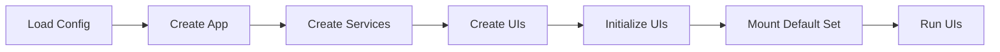
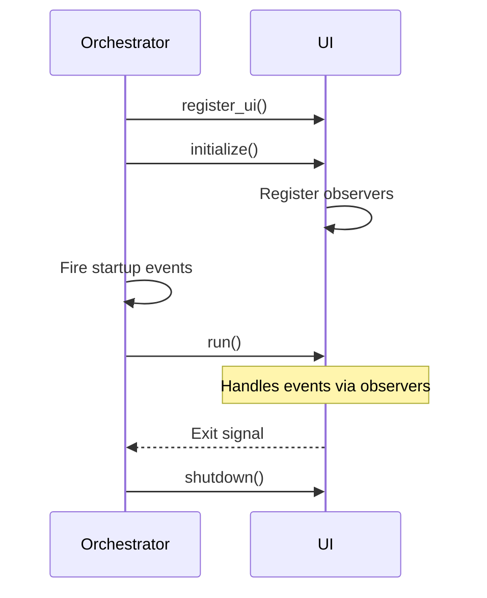
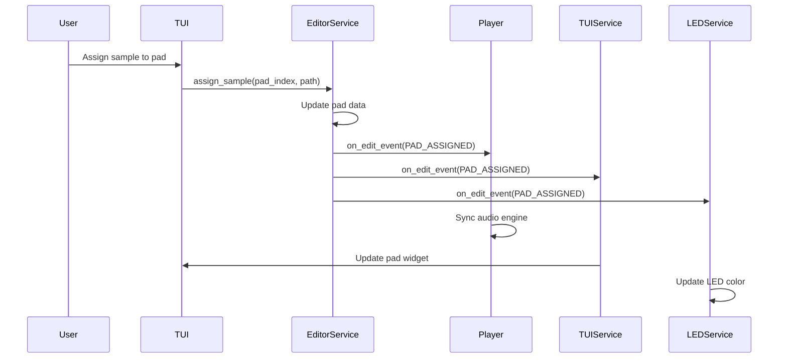
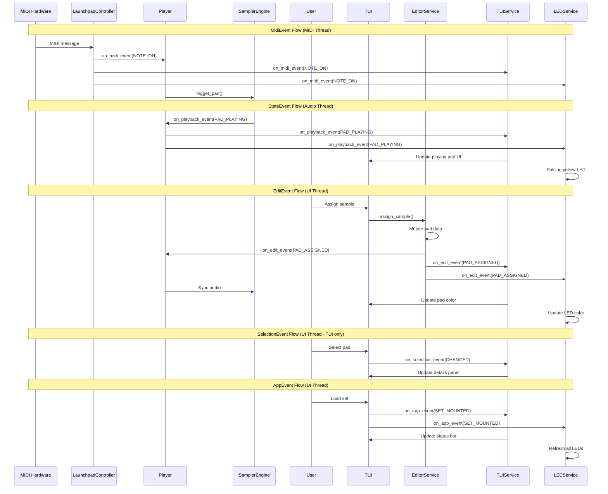

# LAUNCHSAMPLER ARCHITECTURE

## Overview

Launchsampler is a multi-threaded, event-driven sampler application built on protocol-based design principles. The architecture prioritizes:

- **Decoupling through Observers**: 5 observer protocols enable complete separation between UI, business logic, and audio engine
- **Protocol over Inheritance**: Runtime-checkable protocols define contracts without rigid class hierarchies
- **Multiple UIs**: UIAdapter protocol allows TUI and LED UI to run simultaneously, synchronized via events
- **Thread Safety**: Audio, MIDI, and UI threads communicate through lock-free queues and careful synchronization
- **Single Responsibility**: Each layer has clear boundaries - UI renders, Services mutate, Core executes, Devices abstract hardware
- **Centralized Color Management**: Single source of truth (`ui_colors.py`) ensures visual consistency across all UIs

This design makes adding new UIs, devices, or features straightforward: implement the protocol, register observers, and the system automatically handles synchronization.

---

**Startup Flow:**



---

## 1. Initialization Sequence



**Note:** Multiple UIs can be registered with the orchestrator simultaneously.

**Lifecycle:**
1. **Register**: UIs register with orchestrator before initialization
2. **Initialize**: UIs register as observers on all relevant protocols
3. **Startup Events**: Orchestrator fires initial state events (SET_MOUNTED, MODE_CHANGED)
4. **Run**: UIs start (blocking for TUI, non-blocking for LED)
5. **Event Loop**: UIs respond to observer events during runtime
6. **Shutdown**: UIs cleanup and unregister observers

---

## 2. Application Layers

```
┌─────────────────────────────────────────────────────────────┐
│ ORCHESTRATOR                                                │
│   LaunchpadSamplerApp                                       │
│   - Owns core state (launchpad, current_set, mode)          │
│   - Creates and manages services                            │
│   - Coordinates UI lifecycle                                │
└─────────────────────────────────────────────────────────────┘
                              │
                ┌─────────────┼─────────────┐
                │             │             │
                ▼             ▼             ▼
┌─────────────────────────────────────────────────────────────┐
│ UI LAYER (UIAdapter Protocol)                               │
├──────────────────────────────┬──────────────────────────────┤
│ TUI (Textual Terminal)       │ LED (Launchpad Hardware)     │
│ - Interactive UI             │ - Background UI              │
│ - Blocking run()             │ - Non-blocking run()         │
│                              │                              │
│ ┌──────────────────────┐     │ ┌──────────────────────┐     │
│ │ TUIService           │     │ │ LEDService           │     │
│ │ - All 5 observers    │     │ │ - 4 observers        │     │
│ │ - Syncs TUI widgets  │     │ │ - Syncs hardware LEDs│     │
│ └──────────────────────┘     │ └──────────────────────┘     │
└──────────────────────────────┴──────────────────────────────┘
                │                            │
                └────────────┬───────────────┘
                             ▼
┌─────────────────────────────────────────────────────────────┐
│ SERVICE LAYER (Business Logic)                              │
├──────────────────────────────┬──────────────────────────────┤
│ EditorService                │ SetManagerService            │
│ - Pad editing operations     │ - Set loading/saving         │
│ - Fires EditEvent            │ - Sample scanning            │
│ - Clipboard (copy/paste/cut) │ - JSON serialization         │
└──────────────────────────────┴──────────────────────────────┘
                             │
                             ▼
┌─────────────────────────────────────────────────────────────┐
│ CORE LAYER (Audio & MIDI Engine)                            │
├─────────────────┬─────────────────┬─────────────────────────┤
│ Player          │ SamplerEngine   │ LaunchpadController     │
│ - Coordinator   │ - Audio playback│ - MIDI device mgmt      │
│ - 3 observers   │ - Multi-pad mix │ - Event translation     │
│ - Event relay   │ - Thread-safe   │ - MIDI polling thread   │
└─────────────────┴─────────────────┴─────────────────────────┘
                                                │
                                                ▼
┌─────────────────────────────────────────────────────────────┐
│ DEVICE LAYER (Hardware Abstraction)                         │
│                                                             │
│   Device Protocol                                           │
│   ├─ DeviceInput: parse_message() → DeviceEvent             │
│   └─ DeviceOutput: set_led(), set_leds_bulk(), etc.         │
│                                                             │
│   LaunchpadDevice (implements Device)                       │
│   ├─ LaunchpadInput (MIDI → DeviceEvent)                    │
│   ├─ LaunchpadOutput (LED control via SysEx)                │
│   ├─ LaunchpadNoteMapper (hardware ↔ logical mapping)       │
│   └─ LaunchpadModel (Mini MK3, Pro MK3, etc.)               │
└─────────────────────────────────────────────────────────────┘
```

**Data Flow:**
```
User Input (TUI/MIDI)
  → Service (EditorService/Player)
  → Event fired (EditEvent/MidiEvent/StateEvent)
  → Observers notified (TUIService, LEDService, Player)
  → Core Engine (SamplerEngine, LaunchpadController)
  → Hardware (Audio output, LED updates)
```

**Key Principles:**
- Protocol-based design (no inheritance)
- Observer pattern for event-driven architecture
- Service layer encapsulates business logic
- Multiple UIs via UIAdapter protocol

---

## 3. Thread Model

Launchsampler runs on **three independent threads** with careful synchronization:

```
┌─────────────────────────────────────────────────────────────┐
│ UI THREAD (Textual asyncio event loop)                     │
│                                                             │
│ Responsibilities:                                           │
│ - TUI rendering and user input                             │
│ - EditorService mutations (pad data changes)               │
│ - SelectionObserver, AppObserver events                    │
│                                                             │
│ Communication:                                              │
│ → Fires EditEvent to other threads (observers notified)    │
│ ← Receives StateEvent, MidiEvent (thread-safe callbacks)   │
└─────────────────────────────────────────────────────────────┘

┌─────────────────────────────────────────────────────────────┐
│ MIDI THREAD (mido blocking poll)                           │
│                                                             │
│ Responsibilities:                                           │
│ - Poll MIDI hardware for messages                          │
│ - Parse MIDI → DeviceEvent → MidiEvent                     │
│ - Fire MidiObserver events                                 │
│                                                             │
│ Communication:                                              │
│ → Fires MidiEvent to Player (trigger_pad via queue)        │
│ → Notifies TUIService, LEDService (thread-safe callbacks)  │
└─────────────────────────────────────────────────────────────┘

┌─────────────────────────────────────────────────────────────┐
│ AUDIO THREAD (sounddevice callback - real-time)            │
│                                                             │
│ Responsibilities:                                           │
│ - Process trigger queue (lock-free)                        │
│ - Mix audio from multiple pads                             │
│ - Fire StateObserver events (PAD_PLAYING, etc.)            │
│                                                             │
│ Communication:                                              │
│ ← Receives triggers via lock-free queue                    │
│ → Fires StateEvent to observers (thread-safe callbacks)    │
│                                                             │
│ Critical: NO BLOCKING in this thread (real-time audio)     │
└─────────────────────────────────────────────────────────────┘
```

**Synchronization Strategy:**
- **Lock-free trigger queue**: MIDI/UI threads → Audio thread (hot path)
- **Locked observer lists**: EditorService, SamplerStateMachine (released before callbacks)
- **Thread-safe observer callbacks**: All observers must handle cross-thread calls
- **Bulk operations**: LED updates batched to minimize cross-thread overhead

**Thread Safety Examples:**
```python
# Lock-free trigger (MIDI thread → Audio thread)
def trigger_pad(self, pad_index: int):
    self._trigger_queue.put_nowait(("trigger", pad_index))

# Audio thread processes queue (no locks in hot path)
def _audio_callback(self, outdata, frames):
    while not self._trigger_queue.empty():
        action, pad_index = self._trigger_queue.get_nowait()
        # Process trigger...

# Thread-safe observer notification
def _notify_observers(self, event, pad_index):
    with self._lock:
        observers = list(self._observers)  # Copy list
    # Release lock before callbacks
    for observer in observers:
        observer.on_playback_event(event, pad_index)
```

---

## 4. Observer Protocols

### 4.1 Observer Types

| Protocol | Events | Triggered By | Purpose |
|----------|--------|--------------|---------|
| **StateObserver** | PAD_TRIGGERED, PAD_PLAYING, PAD_STOPPED, PAD_FINISHED | SamplerStateMachine | Playback state changes |
| **EditObserver** | PAD_ASSIGNED, PAD_CLEARED, PAD_MOVED, etc. | EditorService | Editing operations |
| **MidiObserver** | NOTE_ON, NOTE_OFF, CONTROLLER_CONNECTED, etc. | LaunchpadController | MIDI hardware events |
| **SelectionObserver** | CHANGED, CLEARED | TUI App | UI selection state |
| **AppObserver** | SET_MOUNTED, SET_SAVED, MODE_CHANGED | App Orchestrator | App lifecycle |

### 4.2 Event Flow



**EditEvent Types:**
- PAD_ASSIGNED: Sample assigned to pad
- PAD_CLEARED: Pad sample removed
- PAD_MOVED: Pad moved/swapped
- PAD_DUPLICATED: Pad duplicated to another location
- PAD_MODE_CHANGED: Playback mode changed
- PAD_VOLUME_CHANGED: Volume changed
- PAD_NAME_CHANGED: Sample name changed
- PADS_CLEARED: Multiple pads cleared

### 4.3 Observer Details

**StateObserver** (Thread: Audio)
```python
on_playback_event(event: PlaybackEvent, pad_index: int)
```
- `PAD_TRIGGERED`: Note received, not yet playing
- `PAD_PLAYING`: Audio started
- `PAD_STOPPED`: Interrupted or note-off
- `PAD_FINISHED`: Completed naturally

**EditObserver** (Thread: UI)
```python
on_edit_event(event: EditEvent, pad_indices: list[int], pads: list[Pad])
```
- 8 event types: ASSIGNED, CLEARED, MOVED, DUPLICATED, MODE_CHANGED, VOLUME_CHANGED, NAME_CHANGED, PADS_CLEARED
- Fired by EditorService after mutations
- Auto-syncs Player + all UIs

**MidiObserver** (Thread: MIDI)
```python
on_midi_event(event: MidiEvent, pad_index: int, control: int = 0, value: int = 0)
```
- Hardware events from controller
- Fired by LaunchpadController MIDI polling

**SelectionObserver** (Thread: UI)
```python
on_selection_event(event: SelectionEvent, pad_index: Optional[int])
```
- TUI-specific (ephemeral, not persisted)
- CHANGED when pad selected, CLEARED otherwise

**AppObserver** (Thread: UI)
```python
on_app_event(event: AppEvent, **kwargs)
```
- App-level state changes
- SET_MOUNTED, SET_SAVED, MODE_CHANGED

### 4.4 Complete Observer Data Flow



---

## 5. Device Protocol

### 5.1 Protocol Structure

```
┌─────────────────────────────────────────────────────────────┐
│ Device Protocol                                             │
│   - Composition of input and output interfaces              │
│   - Hardware-agnostic abstraction                           │
├──────────────────────────────┬──────────────────────────────┤
│ DeviceInput Protocol         │ DeviceOutput Protocol        │
│                              │                              │
│ parse_message(msg)           │ initialize()                 │
│   → DeviceEvent              │ shutdown()                   │
│                              │ set_led(index, color)        │
│ Responsibilities:            │ set_leds_bulk(updates)       │
│ - Parse hardware messages    │ clear_all()                  │
│ - Map to logical indices     │                              │
│ - Return typed events        │ Responsibilities:            │
│                              │ - Initialize hardware        │
│                              │ - Control LED output         │
│                              │ - Bulk updates for efficiency│
└──────────────────────────────┴──────────────────────────────┘
                │
                ▼
┌─────────────────────────────────────────────────────────────┐
│ DeviceEvent (base class)                                    │
├─────────────────┬─────────────────┬─────────────────────────┤
│ PadPressEvent   │ PadReleaseEvent │ ControlChangeEvent      │
│ - pad_index     │ - pad_index     │ - control               │
│ - velocity      │                 │ - value                 │
└─────────────────┴─────────────────┴─────────────────────────┘
```

### 5.2 Device Abstraction

**Key Concepts:**
- **Logical Indices**: All events use 0-63 indexing (abstracted)
- **Hardware Mapping**: DeviceInput handles model-specific note mapping
- **Bulk Updates**: Output supports batch LED updates for efficiency
- **Thread Safety**: Input called from MIDI thread, Output from any thread

---

## 6. Launchpad Implementation

### 6.1 Component Composition

```
┌─────────────────────────────────────────────────────────────┐
│ LaunchpadDevice (implements Device Protocol)                │
│   - Detects model from MIDI port names                      │
│   - Composes Input + Output                                 │
│   - NUM_PADS = 64, GRID_SIZE = 8                            │
├──────────────────┬──────────────────┬───────────────────────┤
│ LaunchpadInput   │ LaunchpadOutput  │ LaunchpadModel        │
│                  │                  │                       │
│ Responsibilities:│ Responsibilities:│ Enum:                 │
│ - Parse MIDI     │ - SysEx mode     │ - MINI_MK3            │
│ - Note mapping   │ - RGB LED ctrl   │ - PRO_MK3             │
│ - Event creation │ - Palette ctrl   │ - X                   │
│                  │ - Bulk updates   │ - MK2                 │
│                  │                  │                       │
│ Uses:            │ Uses:            │ Provides:             │
│ NoteMapper       │ SysEx Messages   │ - Port detection      │
│                  │                  │ - Note mappings       │
└──────────────────┴──────────────────┴───────────────────────┘
```

### 6.2 Implementation Details

**LaunchpadDevice**
- Detects model from MIDI port names
- Composes Input + Output
- NUM_PADS = 64, GRID_SIZE = 8

**LaunchpadInput**
- Parses MIDI → DeviceEvent
- Uses NoteMapper for hardware-to-logical conversion
- Handles note on/off, CC messages

**LaunchpadOutput**
- Initializes programmer mode (SysEx)
- RGB LED control via SysEx (6-bit per channel)
- Palette-based control (static/pulsing/flashing)
- Bulk updates for performance

**LaunchpadNoteMapper**
- Model-specific mappings (Mini MK3, Pro MK3, etc.)
- Bidirectional: MIDI note ↔ logical index
- XY coordinate mapping

**Supported Models:**
- Mini MK3 (primary)
- Pro MK3
- X, MK2

**SysEx Messages:**
```python
# Enter programmer mode
F0 00 20 29 02 0D 00 7F F7

# Set RGB LED
F0 00 20 29 02 0D 03 [index] [r] [g] [b] F7
```

---

## 7. UIAdapter Protocol + Color Management

### 7.1 Color Management

```
┌─────────────────────────────────────────────────────────────┐
│ ui_colors.py (Single Source of Truth)                       │
│   - MODE_COLORS: PlaybackMode → LaunchpadColor              │
│   - get_pad_led_color(pad, is_playing) → Color              │
│   - get_pad_led_palette_index(pad, is_playing) → int        │
└─────────────────────────────────────────────────────────────┘
                │
                ▼
┌─────────────────────────────────────────────────────────────┐
│ LaunchpadColor Enum (128 colors)                            │
│   Each color has two properties:                            │
├──────────────────────────────┬──────────────────────────────┤
│ .rgb → Color(r, g, b)        │ .palette → int (0-127)       │
│                              │                              │
│ Used for:                    │ Used for:                    │
│ - TUI CSS backgrounds        │ - LED animations             │
│ - LED static RGB control     │ - Pulsing/flashing effects   │
└──────────────────────────────┴──────────────────────────────┘
                │
                ▼
┌─────────────────────────────────────────────────────────────┐
│ Color Priority (get_pad_led_color logic)                    │
├─────────────────┬─────────────────┬─────────────────────────┤
│ 1. Playing      │ 2. Assigned     │ 3. Empty                │
│ → YELLOW        │ → Mode Color    │ → BLACK                 │
│                 │   ONE_SHOT: RED │                         │
│ Always overrides│   LOOP: GREEN   │ Pad has no sample       │
│                 │   HOLD: BLUE    │                         │
│                 │   LOOP_TOGGLE:  │                         │
│                 │   MAGENTA       │                         │
└─────────────────┴─────────────────┴─────────────────────────┘
```

**Color Priority:**
1. Playing state → YELLOW (always overrides)
2. Assigned pad → Mode color (RED/GREEN/BLUE/MAGENTA)
3. Empty pad → BLACK

**Mode Colors:**
| Mode | Color |
|------|-------|
| ONE_SHOT | RED |
| LOOP | GREEN |
| HOLD | BLUE |
| LOOP_TOGGLE | MAGENTA |

**Color Resolution Functions:**
```python
# Single source of truth
get_pad_led_color(pad, is_playing: bool) -> Color
get_pad_led_palette_index(pad, is_playing: bool) -> int
```

**LaunchpadColor Properties:**
```python
LaunchpadColor.RED.rgb      # → Color(255, 0, 0)
LaunchpadColor.RED.palette  # → 5 (palette index)
```

---

## 8. TUI Implementation

### 8.1 TUI Architecture

```
┌─────────────────────────────────────────────────────────────┐
│ LaunchpadSampler (Textual App - Interactive UI)             │
│   - Blocking run()                                          │
│   - Edit Mode: Sample assignment, pad editing               │
│   - Play Mode: MIDI performance                             │
├──────────────────────────────┬──────────────────────────────┤
│ Widgets                      │ TUIService (All 5 Observers) │
│                              │                              │
│ PadGrid                      │ StateObserver                │
│ - 8x8 grid display           │ → Playing pad feedback       │
│ - User interaction           │                              │
│ - Calls EditorService        │ EditObserver                 │
│                              │ → Update pad colors/labels   │
│ PadDetailsPanel              │                              │
│ - Selected pad info          │ MidiObserver                 │
│ - Sample, mode, volume       │ → Highlight MIDI triggers    │
│                              │                              │
│ StatusBar                    │ SelectionObserver            │
│ - Current mode               │ → Update details panel       │
│ - Set name                   │                              │
│ - Messages                   │ AppObserver                  │
│                              │ → Update status bar          │
│ FileBrowser                  │                              │
│ - Sample file selection      │ Thread-safe widget updates   │
└──────────────────────────────┴──────────────────────────────┘
                │
                ▼
┌─────────────────────────────────────────────────────────────┐
│ User Actions (PadGrid)                                      │
│   → EditorService methods                                   │
│     - assign_sample(), clear_pad(), change_mode()           │
│     - copy_pad(), paste_pad(), duplicate_pad()              │
│     - set_volume(), set_name()                              │
└─────────────────────────────────────────────────────────────┘
```

### 8.2 TUI Features

**Modes:**
- Edit Mode: Sample assignment, pad editing
- Play Mode: MIDI performance (locked editing)

**Widgets:**
- **PadGrid**: 8x8 grid of pad buttons
- **PadDetailsPanel**: Selected pad info (sample, mode, volume)
- **StatusBar**: Current mode, set name, messages
- **FileBrowser**: Sample file selection

**TUIService Responsibilities:**
- Implements all 5 observer protocols
- Updates widgets on state changes
- Syncs pad colors, labels, details
- Shows MIDI feedback (highlights MIDI-triggered pads)
- Thread-safe (called from multiple threads)

**Color Management:**
```python
# TUI uses CSS classes for state overlays
SELECTED_TUI_CLASS = "selected"   # $warning theme (yellow border)
MIDI_ON_TUI_CLASS = "midi_on"     # $primary theme (blue highlight)

# Base colors from get_pad_led_color()
pad_button.background = get_pad_led_color(pad, is_playing)
```

---

## 9. LED Implementation

### 9.1 LED Architecture

```
┌─────────────────────────────────────────────────────────────┐
│ LaunchpadLEDUI (Background UI)                              │
│   - Non-blocking run()                                      │
│   - Runs alongside TUI                                      │
│   - Mirrors 8x8 grid state on hardware                      │
│   - Reuses Player's LaunchpadController (no port conflict)  │
├──────────────────────────────┬──────────────────────────────┤
│ LEDService (4 Observers)     │ Visual Feedback              │
│                              │                              │
│ StateObserver                │ Assigned Pads:               │
│ → Playing pad LEDs           │ - Static mode color          │
│ → Pulsing yellow animation   │   (RED/GREEN/BLUE/MAGENTA)   │
│                              │                              │
│ EditObserver                 │ Playing Pads:                │
│ → Update pad colors          │ - Pulsing yellow animation   │
│ → On assignment/changes      │                              │
│                              │                              │
│ MidiObserver                 │ Empty Pads:                  │
│ → Device connect/disconnect  │ - Off (black)                │
│                              │                              │
│ AppObserver                  │ Panic Button:                │
│ → Handle set changes         │ - Red LED indicator          │
│                              │                              │
│ Bulk LED updates for         │ Uses ui_colors.py:           │
│ efficiency                   │ - get_pad_led_color()        │
│                              │ - get_pad_led_palette_index()│
└──────────────────────────────┴──────────────────────────────┘
                │
                ▼
┌─────────────────────────────────────────────────────────────┐
│ Hardware Control Chain                                      │
│   LEDService                                                │
│     → LaunchpadController                                   │
│       → LaunchpadDevice                                     │
│         → Physical Hardware LEDs                            │
└─────────────────────────────────────────────────────────────┘
```

### 9.2 LED Features

**Background UI:**
- Non-blocking (run() returns immediately)
- Mirrors 8x8 grid state on Launchpad hardware
- Runs alongside TUI

**Visual Feedback:**
- **Assigned Pads**: Static mode color (RED/GREEN/BLUE/MAGENTA)
- **Playing Pads**: Pulsing yellow animation
- **Empty Pads**: Off (black)
- **Panic Button**: Red LED when active

**LEDService Responsibilities:**
- Implements 4 observer protocols (not SelectionObserver - TUI-only)
- Updates Launchpad LEDs on state changes
- Uses bulk LED updates for efficiency
- Handles device connect/disconnect gracefully

**Controller Reuse:**
```python
# LED UI reuses Player's LaunchpadController
# No port conflicts - same controller instance
led_ui = LaunchpadLEDUI(controller=player.controller)
```

**Animation Example:**
```python
# Playing pad - pulsing yellow
palette_index = get_pad_led_palette_index(pad, is_playing=True)
controller.set_pad_pulsing(pad_index, palette_index)

# Static mode color
color = get_pad_led_color(pad, is_playing=False)
controller.set_pad_color(pad_index, color)
```

---

## 10. Additional System Components

### 10.1 Set Persistence

**Set Model:**
```python
@dataclass
class Set:
    name: str
    pads: list[Pad]  # 64 pads
    metadata: dict
```

**Pad Model:**
```python
@dataclass
class Pad:
    sample_path: Optional[Path]
    mode: PlaybackMode
    volume: float  # 0.0 - 1.0
    name: Optional[str]
```

**Storage:**
- JSON format (SetManagerService)
- Absolute paths to samples
- Metadata: created_at, modified_at

### 10.2 Configuration

**AppConfig:**
- Default set path
- Audio device selection
- MIDI device selection
- Sample library directories

---

## File Reference

**Protocols & Enums:**
- [protocols.py](src/launchsampler/protocols.py) - All observer protocols
- [models/enums.py](src/launchsampler/models/enums.py) - PlaybackMode, LaunchpadColor

**Orchestrator:**
- [app.py](src/launchsampler/app.py) - LaunchpadSamplerApp

**Services:**
- [services/editor_service.py](src/launchsampler/services/editor_service.py)
- [services/set_manager_service.py](src/launchsampler/services/set_manager_service.py)
- [tui/services/tui_service.py](src/launchsampler/tui/services/tui_service.py)
- [led_ui/services/led_service.py](src/launchsampler/led_ui/services/led_service.py)

**Core Engine:**
- [core/player.py](src/launchsampler/core/player.py)
- [core/sampler_engine.py](src/launchsampler/core/sampler_engine.py)
- [core/state_machine.py](src/launchsampler/core/state_machine.py)

**Device Layer:**
- [devices/protocols.py](src/launchsampler/devices/protocols.py)
- [devices/launchpad/device.py](src/launchsampler/devices/launchpad/device.py)
- [devices/launchpad/controller.py](src/launchsampler/devices/launchpad/controller.py)
- [devices/launchpad/input.py](src/launchsampler/devices/launchpad/input.py)
- [devices/launchpad/output.py](src/launchsampler/devices/launchpad/output.py)

**UI Layer:**
- [tui/app.py](src/launchsampler/tui/app.py)
- [led_ui/app.py](src/launchsampler/led_ui/app.py)
- [ui_colors.py](src/launchsampler/ui_colors.py) - Color management
