# LAUNCHSAMPLER - COMPREHENSIVE ARCHITECTURE ANALYSIS

**Generated:** 2025-11-20
**Version:** Current (post-restructure)
**Codebase Size:** 92 Python files, ~15,000 LOC

---

## TABLE OF CONTENTS

1. [Executive Summary](#1-executive-summary)
2. [High-Level Architecture](#2-high-level-architecture)
3. [Layer Architecture](#3-layer-architecture)
4. [Component Deep Dive](#4-component-deep-dive)
5. [Data Flow Analysis](#5-data-flow-analysis)
6. [Event Flow Architecture](#6-event-flow-architecture)
7. [Threading Model](#7-threading-model)
8. [Protocol & Observer Patterns](#8-protocol--observer-patterns)
9. [Dependency Graph](#9-dependency-graph)
10. [Data Models & State](#10-data-models--state)
11. [Entry Points & Lifecycle](#11-entry-points--lifecycle)
12. [Key Design Patterns](#12-key-design-patterns)
13. [Critical Architectural Decisions](#13-critical-architectural-decisions)

---

## 1. EXECUTIVE SUMMARY

### What is Launchsampler?

Launchsampler is a sophisticated, multi-threaded audio sampler application designed for grid-based MIDI controllers (primarily Novation Launchpad). It enables users to trigger audio samples using hardware pads, with a terminal-based user interface and LED feedback on the hardware.

### Architectural Highlights

- **Protocol-First Design**: Zero inheritance hierarchies, 100% composition via runtime-checkable protocols
- **Observer Pattern Pervasive**: 5 event types, 5 observer protocols, complete decoupling of concerns
- **Multi-Threaded**: 3 independent threads (UI, MIDI, Audio) with lock-free hot paths
- **Generic Reusability**: `ObserverManager[T]` eliminates ~150 lines of duplicate code
- **Single Source of Truth**: Shared `SamplerStateMachine` injected across audio components
- **Multi-UI Architecture**: TUI + LED UI run simultaneously, easy to add more UIs
- **Device Abstraction**: Registry pattern supports multiple MIDI controllers without code changes

### Key Metrics

| Metric | Value |
|--------|-------|
| Total Python Files | 92 |
| Main Packages | 10 |
| Observer Protocols | 5 |
| Event Types | 5 enums (24 total events) |
| Data Models | 8 Pydantic models |
| Threads | 3 (UI, MIDI, Audio) |
| Supported Devices | Extensible (Launchpad MK3 shipped) |

---

## 2. HIGH-LEVEL ARCHITECTURE

### System Overview Diagram

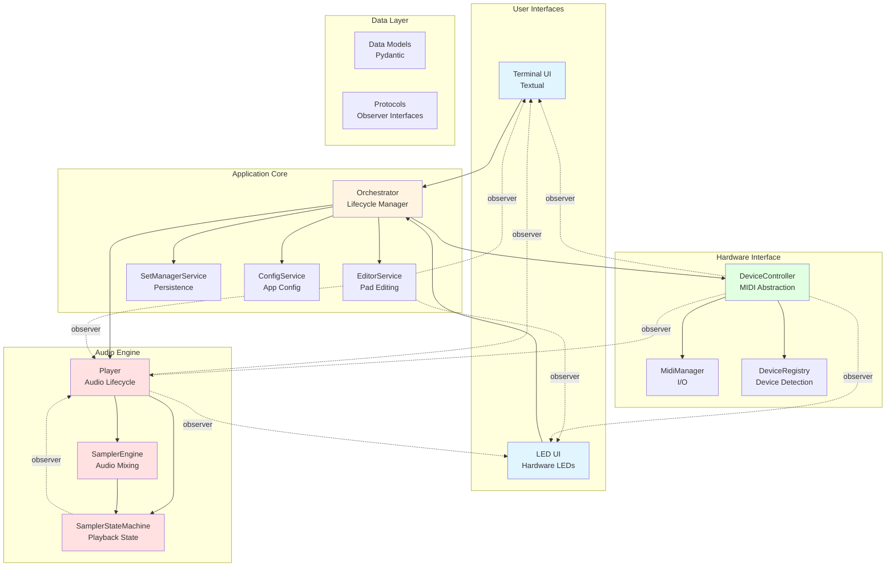
```mermaid
graph TB
    subgraph "User Interfaces"
        TUI[Terminal UI<br/>Textual]
        LED[LED UI<br/>Hardware LEDs]
    end

    subgraph "Application Core"
        ORCH[Orchestrator<br/>Lifecycle Manager]
        EDITOR[EditorService<br/>Pad Editing]
        SETMGR[SetManagerService<br/>Persistence]
        CONFIG[ConfigService<br/>App Config]
    end

    subgraph "Audio Engine"
        PLAYER[Player<br/>Audio Lifecycle]
        ENGINE[SamplerEngine<br/>Audio Mixing]
        STATE[SamplerStateMachine<br/>Playback State]
    end

    subgraph "Hardware Interface"
        DEVICE[DeviceController<br/>MIDI Abstraction]
        MIDI[MidiManager<br/>I/O]
        REGISTRY[DeviceRegistry<br/>Device Detection]
    end

    subgraph "Data Layer"
        MODELS[Data Models<br/>Pydantic]
        PROTOCOLS[Protocols<br/>Observer Interfaces]
    end

    TUI --> ORCH
    LED --> ORCH
    ORCH --> EDITOR
    ORCH --> SETMGR
    ORCH --> CONFIG
    ORCH --> PLAYER
    ORCH --> DEVICE
    PLAYER --> ENGINE
    PLAYER --> STATE
    ENGINE --> STATE
    DEVICE --> MIDI
    DEVICE --> REGISTRY
    EDITOR -.observer.-> PLAYER
    DEVICE -.observer.-> PLAYER
    STATE -.observer.-> PLAYER
    PLAYER -.observer.-> TUI
    PLAYER -.observer.-> LED
    EDITOR -.observer.-> TUI
    EDITOR -.observer.-> LED
    DEVICE -.observer.-> TUI
    DEVICE -.observer.-> LED

    style TUI fill:#e1f5ff
    style LED fill:#e1f5ff
    style ORCH fill:#fff4e1
    style PLAYER fill:#ffe1e1
    style ENGINE fill:#ffe1e1
    style STATE fill:#ffe1e1
    style DEVICE fill:#e1ffe1
```

### Communication Pattern

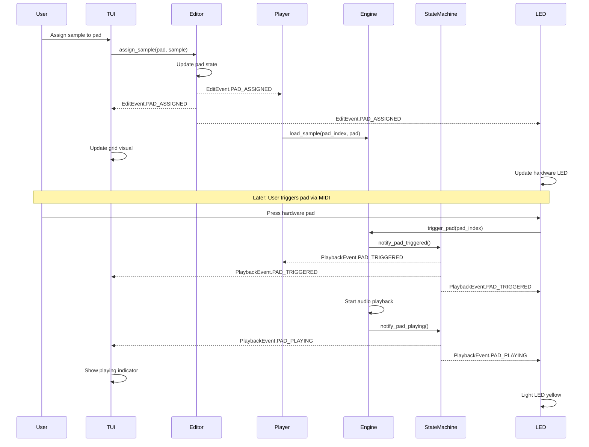
```mermaid
sequenceDiagram
    participant User
    participant TUI
    participant Editor
    participant Player
    participant Engine
    participant StateMachine
    participant LED

    User->>TUI: Assign sample to pad
    TUI->>Editor: assign_sample(pad, sample)
    Editor->>Editor: Update pad state
    Editor-->>Player: EditEvent.PAD_ASSIGNED
    Editor-->>TUI: EditEvent.PAD_ASSIGNED
    Editor-->>LED: EditEvent.PAD_ASSIGNED
    Player->>Engine: load_sample(pad_index, pad)
    TUI->>TUI: Update grid visual
    LED->>LED: Update hardware LED

    Note over User,LED: Later: User triggers pad via MIDI

    User->>LED: Press hardware pad
    LED->>Engine: trigger_pad(pad_index)
    Engine->>StateMachine: notify_pad_triggered()
    StateMachine-->>Player: PlaybackEvent.PAD_TRIGGERED
    StateMachine-->>TUI: PlaybackEvent.PAD_TRIGGERED
    StateMachine-->>LED: PlaybackEvent.PAD_TRIGGERED
    Engine->>Engine: Start audio playback
    Engine->>StateMachine: notify_pad_playing()
    StateMachine-->>TUI: PlaybackEvent.PAD_PLAYING
    StateMachine-->>LED: PlaybackEvent.PAD_PLAYING
    TUI->>TUI: Show playing indicator
    LED->>LED: Light LED yellow
```

---

## 3. LAYER ARCHITECTURE

### Layered View

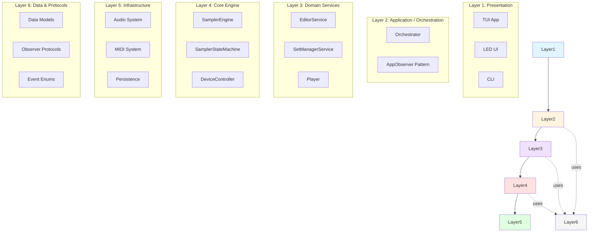
```mermaid
graph TB
    subgraph "Layer 1: Presentation"
        direction LR
        TUI1[TUI App]
        LED1[LED UI]
        CLI1[CLI]
    end

    subgraph "Layer 2: Application / Orchestration"
        direction LR
        ORCH1[Orchestrator]
        APPOBS[AppObserver Pattern]
    end

    subgraph "Layer 3: Domain Services"
        direction LR
        EDITOR1[EditorService]
        SETMGR1[SetManagerService]
        PLAYER1[Player]
    end

    subgraph "Layer 4: Core Engine"
        direction LR
        ENGINE1[SamplerEngine]
        STATE1[SamplerStateMachine]
        DEVICE1[DeviceController]
    end

    subgraph "Layer 5: Infrastructure"
        direction LR
        AUDIO1[Audio System]
        MIDI1[MIDI System]
        PERSIST[Persistence]
    end

    subgraph "Layer 6: Data & Protocols"
        direction LR
        MODELS1[Data Models]
        PROTO1[Observer Protocols]
        EVENTS[Event Enums]
    end

    Layer1 --> Layer2
    Layer2 --> Layer3
    Layer3 --> Layer4
    Layer4 --> Layer5
    Layer2 -.uses.-> Layer6
    Layer3 -.uses.-> Layer6
    Layer4 -.uses.-> Layer6

    style Layer1 fill:#e1f5ff
    style Layer2 fill:#fff4e1
    style Layer3 fill:#f0e1ff
    style Layer4 fill:#ffe1e1
    style Layer5 fill:#e1ffe1
    style Layer6 fill:#f5f5f5
```

### Layer Responsibilities

| Layer | Responsibility | Key Components | Dependencies |
|-------|---------------|----------------|--------------|
| **1. Presentation** | User interaction, rendering | TUI, LED UI, CLI | Layer 2, 6 |
| **2. Orchestration** | Lifecycle, coordination | Orchestrator | Layer 3, 6 |
| **3. Domain Services** | Business logic, editing | EditorService, Player, SetManager | Layer 4, 6 |
| **4. Core Engine** | Audio/MIDI processing | SamplerEngine, DeviceController | Layer 5, 6 |
| **5. Infrastructure** | Low-level I/O | Audio Device, MIDI I/O, File I/O | External libs |
| **6. Data & Protocols** | Contracts, models | Protocols, Events, Models | None |

### Key Principle: Dependency Inversion

All layers depend on **Layer 6 (Protocols)**, not on concrete implementations. This enables:
- Easy testing (mock protocols)
- Loose coupling
- Multiple implementations (multiple UIs)

---

## 4. COMPONENT DEEP DIVE

### 4.1 Orchestrator (`orchestration/orchestrator.py`)

**Role:** Top-level application coordinator

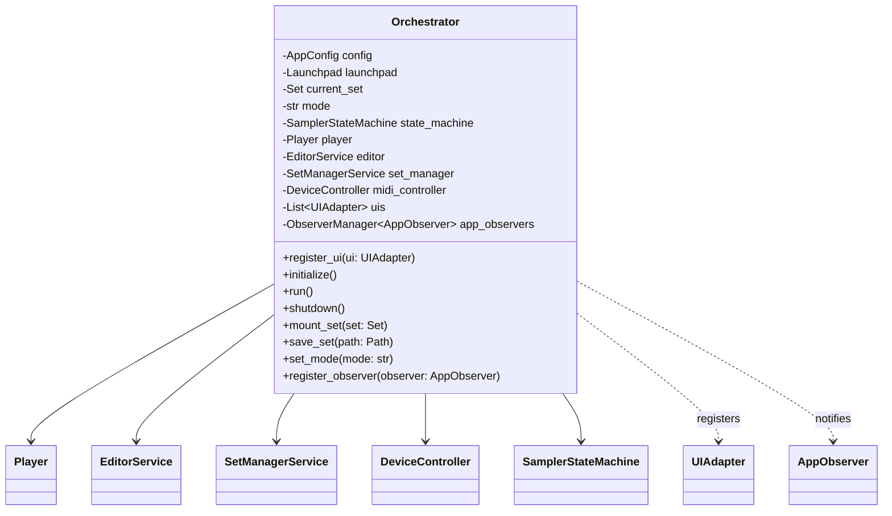
```mermaid
classDiagram
    class Orchestrator {
        -AppConfig config
        -Launchpad launchpad
        -Set current_set
        -str mode
        -SamplerStateMachine state_machine
        -Player player
        -EditorService editor
        -SetManagerService set_manager
        -DeviceController midi_controller
        -List~UIAdapter~ uis
        -ObserverManager~AppObserver~ app_observers

        +register_ui(ui: UIAdapter)
        +initialize()
        +run()
        +shutdown()
        +mount_set(set: Set)
        +save_set(path: Path)
        +set_mode(mode: str)
        +register_observer(observer: AppObserver)
    }

    Orchestrator --> Player
    Orchestrator --> EditorService
    Orchestrator --> SetManagerService
    Orchestrator --> DeviceController
    Orchestrator --> SamplerStateMachine
    Orchestrator ..> UIAdapter : registers
    Orchestrator ..> AppObserver : notifies
```

**Key Responsibilities:**
1. **Ownership**: Owns core state (launchpad, current_set, mode)
2. **Service Creation**: Creates and wires services
3. **Dependency Injection**: Injects shared `SamplerStateMachine` into Player → Engine
4. **UI Registration**: Registers multiple UIs (TUI, LED)
5. **Lifecycle**: initialize → run → shutdown
6. **Event Dispatch**: Fires `AppEvent` to observers

**Initialization Sequence:**
```
1. Create shared SamplerStateMachine
2. Create services (config, set_manager, player, editor)
3. Create DeviceController
4. Start Player audio
5. Register UIs with services (observers)
6. Load initial set
7. Set initial mode
8. Fire startup events (SET_MOUNTED, MODE_CHANGED)
```

---

### 4.2 Player (`core/player.py`)

**Role:** Audio lifecycle manager, observer hub

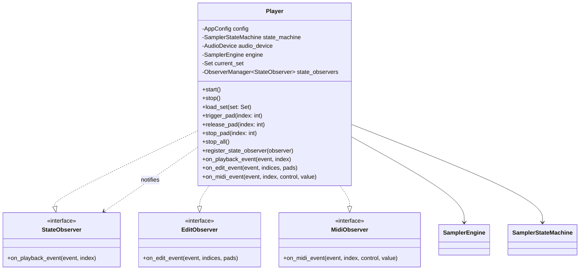
```mermaid
classDiagram
    class Player {
        -AppConfig config
        -SamplerStateMachine state_machine
        -AudioDevice audio_device
        -SamplerEngine engine
        -Set current_set
        -ObserverManager~StateObserver~ state_observers

        +start()
        +stop()
        +load_set(set: Set)
        +trigger_pad(index: int)
        +release_pad(index: int)
        +stop_pad(index: int)
        +stop_all()
        +register_state_observer(observer)
        +on_playback_event(event, index)
        +on_edit_event(event, indices, pads)
        +on_midi_event(event, index, control, value)
    }

    class StateObserver {
        <<interface>>
        +on_playback_event(event, index)
    }

    class EditObserver {
        <<interface>>
        +on_edit_event(event, indices, pads)
    }

    class MidiObserver {
        <<interface>>
        +on_midi_event(event, index, control, value)
    }

    Player ..|> StateObserver
    Player ..|> EditObserver
    Player ..|> MidiObserver
    Player --> SamplerEngine
    Player --> SamplerStateMachine
    Player ..> StateObserver : notifies
```

**Implements 3 Observer Protocols:**
1. **StateObserver**: Receives playback events from `SamplerEngine` → forwards to TUI/LED
2. **EditObserver**: Receives edit events from `EditorService` → syncs audio engine
3. **MidiObserver**: Receives MIDI events from `DeviceController` → triggers audio

**Key Pattern: Observer Chain**
```
EditEvent → Player (observer) → Engine (sync)
MidiEvent → Player (observer) → Engine (trigger)
PlaybackEvent → Player (observer) → TUI/LED (visual)
```

---

### 4.3 SamplerEngine (`core/sampler_engine.py`)

**Role:** Real-time audio mixing and playback

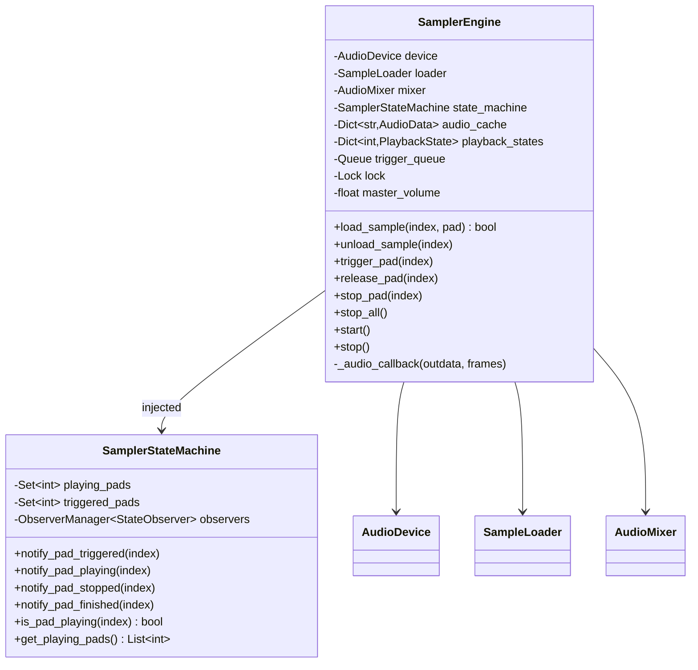
```mermaid
classDiagram
    class SamplerEngine {
        -AudioDevice device
        -SampleLoader loader
        -AudioMixer mixer
        -SamplerStateMachine state_machine
        -Dict~str,AudioData~ audio_cache
        -Dict~int,PlaybackState~ playback_states
        -Queue trigger_queue
        -Lock lock
        -float master_volume

        +load_sample(index, pad) bool
        +unload_sample(index)
        +trigger_pad(index)
        +release_pad(index)
        +stop_pad(index)
        +stop_all()
        +start()
        +stop()
        -_audio_callback(outdata, frames)
    }

    class SamplerStateMachine {
        -Set~int~ playing_pads
        -Set~int~ triggered_pads
        -ObserverManager~StateObserver~ observers

        +notify_pad_triggered(index)
        +notify_pad_playing(index)
        +notify_pad_stopped(index)
        +notify_pad_finished(index)
        +is_pad_playing(index) bool
        +get_playing_pads() List~int~
    }

    SamplerEngine --> SamplerStateMachine : injected
    SamplerEngine --> AudioDevice
    SamplerEngine --> SampleLoader
    SamplerEngine --> AudioMixer
```

**Threading Model:**
- **UI Thread**: Calls `load_sample()` / `unload_sample()` (uses `self._lock`)
- **MIDI Thread**: Calls `trigger_pad()` / `release_pad()` (lock-free queue)
- **Audio Callback Thread**: Runs `_audio_callback()` (no locks, owns playback state)

**Lock Strategy:**
```python
# Lock protects _playback_states during load/unload (rare)
with self._lock:
    self._playback_states[pad_index] = PlaybackState(...)

# Triggers use lock-free queue (frequent, low latency)
self._trigger_queue.put_nowait(("trigger", pad_index))

# Audio callback: lock-free reads (no blocking)
state = self._playback_states[pad_index]  # No lock!
```

**Audio Callback Flow:**
```
1. Process trigger queue (NOTE_ON, NOTE_OFF, STOP)
2. Notify state machine of state changes
3. Get active playback states
4. Mix all active sources
5. Detect finished pads → notify state machine
6. Apply master volume
7. Soft clip
8. Write to output buffer
```

---

### 4.4 SamplerStateMachine (`core/state_machine.py`)

**Role:** Single source of truth for playback state

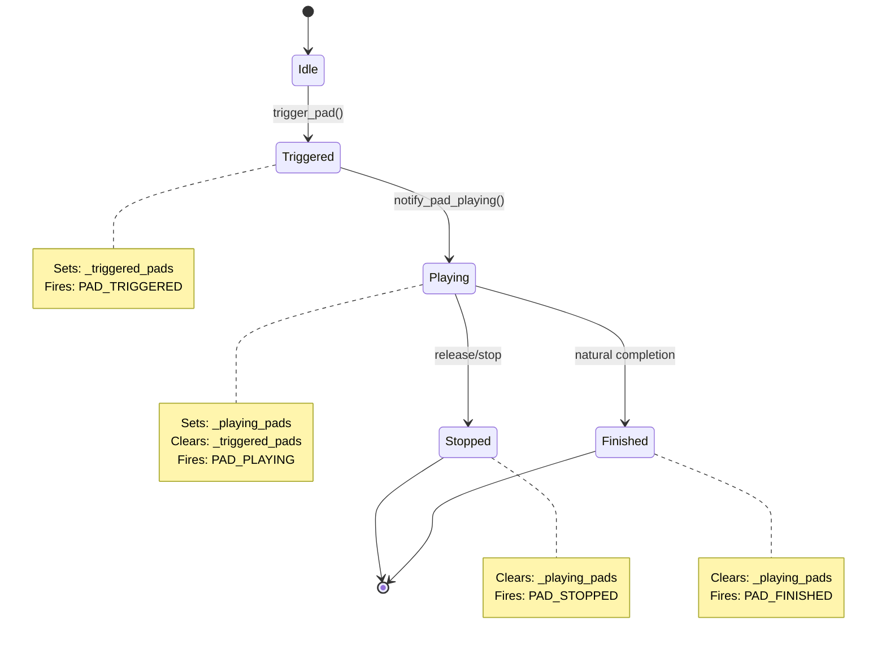
```mermaid
stateDiagram-v2
    [*] --> Idle
    Idle --> Triggered : trigger_pad()
    Triggered --> Playing : notify_pad_playing()
    Playing --> Stopped : release/stop
    Playing --> Finished : natural completion
    Stopped --> [*]
    Finished --> [*]

    note right of Triggered
        Sets: _triggered_pads
        Fires: PAD_TRIGGERED
    end note

    note right of Playing
        Sets: _playing_pads
        Clears: _triggered_pads
        Fires: PAD_PLAYING
    end note

    note right of Stopped
        Clears: _playing_pads
        Fires: PAD_STOPPED
    end note

    note right of Finished
        Clears: _playing_pads
        Fires: PAD_FINISHED
    end note
```

**Key Design: Lock-Release-Before-Notify**
```python
def notify_pad_playing(self, pad_index: int) -> None:
    with self._lock:
        self._triggered_pads.discard(pad_index)
        self._playing_pads.add(pad_index)
    # Lock released HERE - observers can safely query state
    self._observers.notify('on_playback_event', PlaybackEvent.PAD_PLAYING, pad_index)
```

**Why This Matters:**
- Observers can call `is_pad_playing()` during event handling
- Prevents deadlock when observers query state
- Thread-safe state updates

---

### 4.5 EditorService (`services/editor_service.py`)

**Role:** Pad editing operations and event dispatch

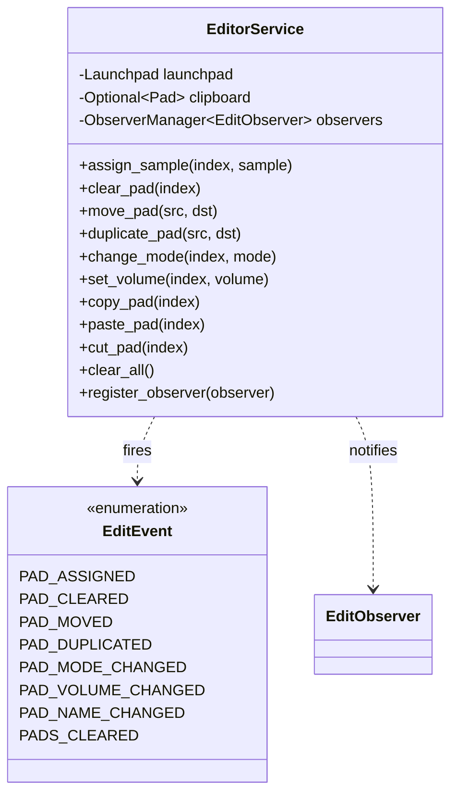
```mermaid
classDiagram
    class EditorService {
        -Launchpad launchpad
        -Optional~Pad~ clipboard
        -ObserverManager~EditObserver~ observers

        +assign_sample(index, sample)
        +clear_pad(index)
        +move_pad(src, dst)
        +duplicate_pad(src, dst)
        +change_mode(index, mode)
        +set_volume(index, volume)
        +copy_pad(index)
        +paste_pad(index)
        +cut_pad(index)
        +clear_all()
        +register_observer(observer)
    }

    class EditEvent {
        <<enumeration>>
        PAD_ASSIGNED
        PAD_CLEARED
        PAD_MOVED
        PAD_DUPLICATED
        PAD_MODE_CHANGED
        PAD_VOLUME_CHANGED
        PAD_NAME_CHANGED
        PADS_CLEARED
    }

    EditorService ..> EditEvent : fires
    EditorService ..> EditObserver : notifies
```

**Edit Operation Pattern:**
```python
def assign_sample(self, pad_index: int, sample: Sample) -> None:
    # 1. Mutate state
    pad = self._launchpad.pads[pad_index]
    pad.sample = sample
    pad.color = self._get_default_color(pad.mode)

    # 2. Fire event to observers
    self._notify_observers(
        EditEvent.PAD_ASSIGNED,
        pad_indices=[pad_index],
        pads=[pad]
    )
```

**Observers Receive:**
- `Player`: Syncs audio engine (load sample)
- `TUIService`: Updates grid visual
- `LEDService`: Updates hardware LED

---

### 4.6 DeviceController (`devices/controller.py`)

**Role:** Hardware abstraction for MIDI grid controllers

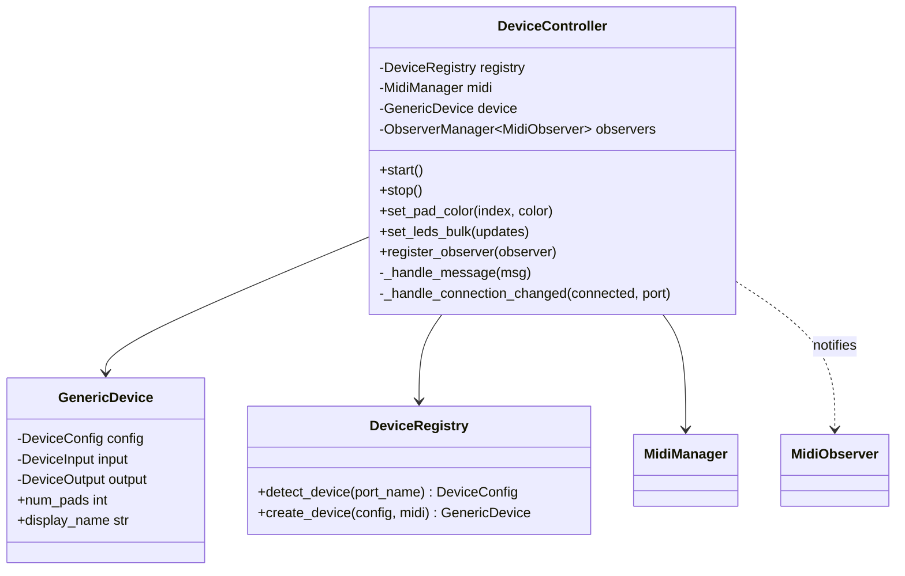
```mermaid
classDiagram
    class DeviceController {
        -DeviceRegistry registry
        -MidiManager midi
        -GenericDevice device
        -ObserverManager~MidiObserver~ observers

        +start()
        +stop()
        +set_pad_color(index, color)
        +set_leds_bulk(updates)
        +register_observer(observer)
        -_handle_message(msg)
        -_handle_connection_changed(connected, port)
    }

    class GenericDevice {
        -DeviceConfig config
        -DeviceInput input
        -DeviceOutput output

        +num_pads int
        +display_name str
    }

    class DeviceRegistry {
        +detect_device(port_name) DeviceConfig
        +create_device(config, midi) GenericDevice
    }

    DeviceController --> GenericDevice
    DeviceController --> DeviceRegistry
    DeviceController --> MidiManager
    DeviceController ..> MidiObserver : notifies
```

**Device Detection Flow:**
```
1. MidiManager polls MIDI ports
2. DeviceController._device_filter() called for each port
3. DeviceRegistry.detect_device() checks port name against configs
4. If match found, create GenericDevice from config
5. DeviceOutput.initialize() (enter programmer mode via SysEx)
6. Notify observers: CONTROLLER_CONNECTED
```

**Abstraction Layers:**
```
DeviceController (user API: set_pad_color, etc.)
    ↓
GenericDevice (composition: input + output + config)
    ↓
DeviceInput/Output protocols (parse_message, set_led, etc.)
    ↓
LaunchpadMK3Input/Output (hardware-specific implementation)
    ↓
MidiManager (raw MIDI I/O)
```

**Key Insight:** DeviceController knows nothing about MIDI notes, SysEx, or hardware quirks. All translation happens in device adapters.

---

### 4.7 ObserverManager[T] (`model_manager/observer.py`)

**Role:** Generic, thread-safe observer pattern implementation

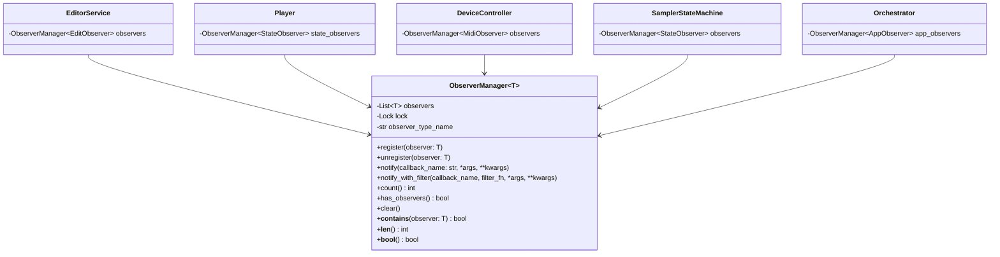
```mermaid
classDiagram
    class ObserverManager~T~ {
        -List~T~ observers
        -Lock lock
        -str observer_type_name

        +register(observer: T)
        +unregister(observer: T)
        +notify(callback_name: str, *args, **kwargs)
        +notify_with_filter(callback_name, filter_fn, *args, **kwargs)
        +count() int
        +has_observers() bool
        +clear()
        +__contains__(observer: T) bool
        +__len__() int
        +__bool__() bool
    }

    class EditorService {
        -ObserverManager~EditObserver~ observers
    }

    class Player {
        -ObserverManager~StateObserver~ state_observers
    }

    class DeviceController {
        -ObserverManager~MidiObserver~ observers
    }

    class SamplerStateMachine {
        -ObserverManager~StateObserver~ observers
    }

    class Orchestrator {
        -ObserverManager~AppObserver~ app_observers
    }

    EditorService --> ObserverManager
    Player --> ObserverManager
    DeviceController --> ObserverManager
    SamplerStateMachine --> ObserverManager
    Orchestrator --> ObserverManager
```

**Why Generic?**
- Eliminates ~150 lines of duplicated observer management code
- Type-safe via generics (`TypeVar`)
- Thread-safe with lock-release-before-notify pattern
- Used in 5+ classes

**Usage Example:**
```python
class MyService:
    def __init__(self):
        self._observers = ObserverManager[MyObserver](observer_type_name="my")

    def do_something(self):
        # ... do work ...
        self._observers.notify('on_something_happened', data)
```

---

## 5. DATA FLOW ANALYSIS

### 5.1 Sample Assignment Flow

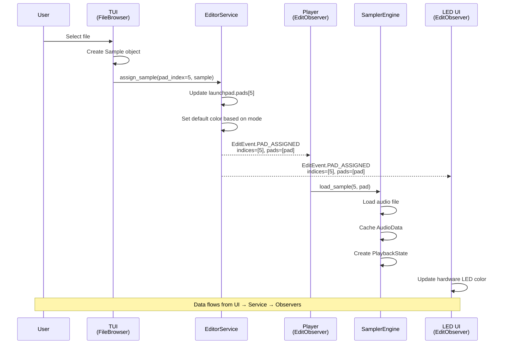
```mermaid
sequenceDiagram
    participant User
    participant TUI as TUI<br/>(FileBrowser)
    participant Editor as EditorService
    participant Player as Player<br/>(EditObserver)
    participant Engine as SamplerEngine
    participant LED as LED UI<br/>(EditObserver)

    User->>TUI: Select file
    TUI->>TUI: Create Sample object
    TUI->>Editor: assign_sample(pad_index=5, sample)

    Editor->>Editor: Update launchpad.pads[5]
    Editor->>Editor: Set default color based on mode

    Editor-->>Player: EditEvent.PAD_ASSIGNED<br/>indices=[5], pads=[pad]
    Editor-->>LED: EditEvent.PAD_ASSIGNED<br/>indices=[5], pads=[pad]

    Player->>Engine: load_sample(5, pad)
    Engine->>Engine: Load audio file
    Engine->>Engine: Cache AudioData
    Engine->>Engine: Create PlaybackState

    LED->>LED: Update hardware LED color

    Note over User,LED: Data flows from UI → Service → Observers
```

### 5.2 MIDI Trigger Flow

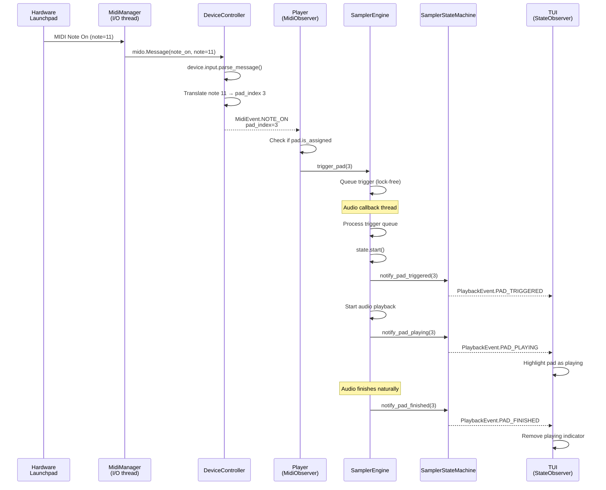
```mermaid
sequenceDiagram
    participant HW as Hardware<br/>Launchpad
    participant MIDI as MidiManager<br/>(I/O thread)
    participant Device as DeviceController
    participant Player as Player<br/>(MidiObserver)
    participant Engine as SamplerEngine
    participant State as SamplerStateMachine
    participant TUI as TUI<br/>(StateObserver)

    HW->>MIDI: MIDI Note On (note=11)
    MIDI->>Device: mido.Message(note_on, note=11)
    Device->>Device: device.input.parse_message()
    Device->>Device: Translate note 11 → pad_index 3

    Device-->>Player: MidiEvent.NOTE_ON<br/>pad_index=3

    Player->>Player: Check if pad.is_assigned
    Player->>Engine: trigger_pad(3)

    Engine->>Engine: Queue trigger (lock-free)

    Note over Engine: Audio callback thread
    Engine->>Engine: Process trigger queue
    Engine->>Engine: state.start()
    Engine->>State: notify_pad_triggered(3)
    State-->>TUI: PlaybackEvent.PAD_TRIGGERED

    Engine->>Engine: Start audio playback
    Engine->>State: notify_pad_playing(3)
    State-->>TUI: PlaybackEvent.PAD_PLAYING

    TUI->>TUI: Highlight pad as playing

    Note over Engine: Audio finishes naturally
    Engine->>State: notify_pad_finished(3)
    State-->>TUI: PlaybackEvent.PAD_FINISHED

    TUI->>TUI: Remove playing indicator
```

### 5.3 Set Loading Flow

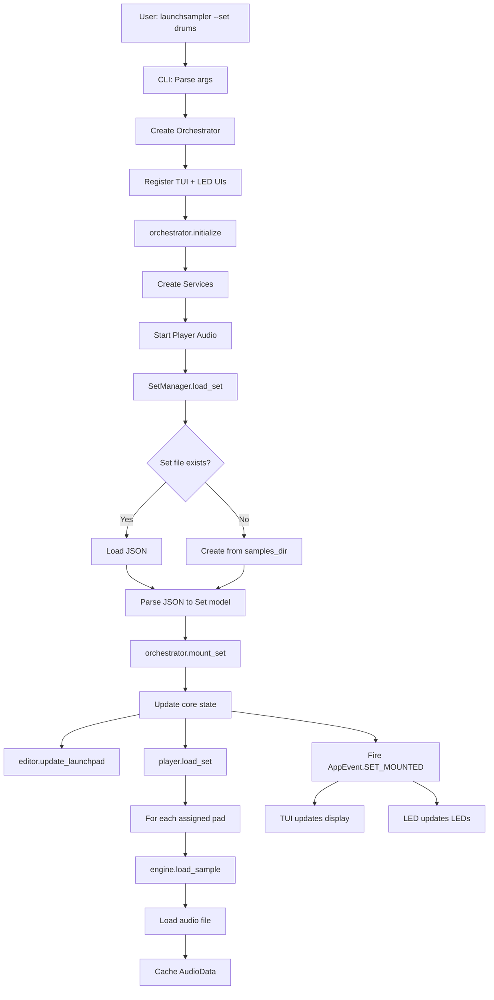
```mermaid
flowchart TD
    A[User: launchsampler --set drums] --> B[CLI: Parse args]
    B --> C[Create Orchestrator]
    C --> D[Register TUI + LED UIs]
    D --> E[orchestrator.initialize]
    E --> F[Create Services]
    F --> G[Start Player Audio]
    G --> H[SetManager.load_set]

    H --> I{Set file exists?}
    I -->|Yes| J[Load JSON]
    I -->|No| K[Create from samples_dir]

    J --> L[Parse JSON to Set model]
    K --> L

    L --> M[orchestrator.mount_set]
    M --> N[Update core state]
    N --> O[editor.update_launchpad]
    N --> P[player.load_set]

    P --> Q[For each assigned pad]
    Q --> R[engine.load_sample]
    R --> S[Load audio file]
    S --> T[Cache AudioData]

    N --> U[Fire AppEvent.SET_MOUNTED]
    U --> V[TUI updates display]
    U --> W[LED updates LEDs]
```

### 5.4 Configuration Flow

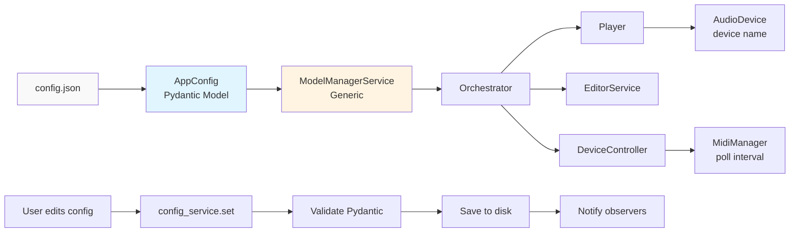
```mermaid
graph LR
    A[config.json] --> B[AppConfig<br/>Pydantic Model]
    B --> C[ModelManagerService<br/>Generic]
    C --> D[Orchestrator]
    D --> E[Player]
    D --> F[EditorService]
    D --> G[DeviceController]

    E --> H[AudioDevice<br/>device name]
    G --> I[MidiManager<br/>poll interval]

    J[User edits config] --> K[config_service.set]
    K --> L[Validate Pydantic]
    L --> M[Save to disk]
    M --> N[Notify observers]

    style A fill:#f9f9f9
    style B fill:#e1f5ff
    style C fill:#fff4e1
```

---

## 6. EVENT FLOW ARCHITECTURE

### 6.1 Event Types Overview

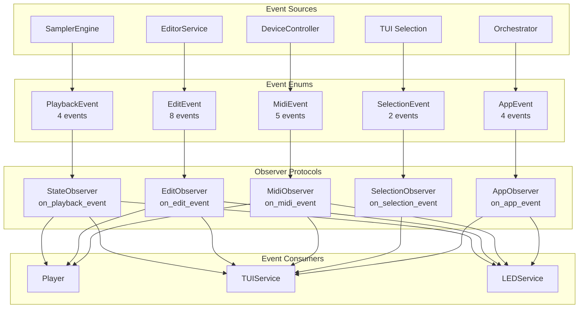
```mermaid
graph TB
    subgraph "Event Enums"
        PE[PlaybackEvent<br/>4 events]
        EE[EditEvent<br/>8 events]
        ME[MidiEvent<br/>5 events]
        SE[SelectionEvent<br/>2 events]
        AE[AppEvent<br/>4 events]
    end

    subgraph "Observer Protocols"
        SO[StateObserver<br/>on_playback_event]
        EO[EditObserver<br/>on_edit_event]
        MO[MidiObserver<br/>on_midi_event]
        SEO[SelectionObserver<br/>on_selection_event]
        AO[AppObserver<br/>on_app_event]
    end

    subgraph "Event Sources"
        ENGINE[SamplerEngine]
        EDITOR[EditorService]
        DEVICE[DeviceController]
        TUI_SEL[TUI Selection]
        ORCH[Orchestrator]
    end

    subgraph "Event Consumers"
        PLAYER[Player]
        TUI[TUIService]
        LED[LEDService]
    end

    ENGINE --> PE
    EDITOR --> EE
    DEVICE --> ME
    TUI_SEL --> SE
    ORCH --> AE

    PE --> SO
    EE --> EO
    ME --> MO
    SE --> SEO
    AE --> AO

    SO --> PLAYER
    SO --> TUI
    SO --> LED
    EO --> PLAYER
    EO --> TUI
    EO --> LED
    MO --> PLAYER
    MO --> TUI
    MO --> LED
    SEO --> TUI
    AO --> TUI
    AO --> LED
```

### 6.2 Event Threading

| Event Type | Source Thread | Destination Thread | Mechanism |
|------------|---------------|-------------------|-----------|
| **PlaybackEvent** | Audio callback | UI thread | Observer notification (cross-thread) |
| **EditEvent** | UI thread | UI thread | Same thread notification |
| **MidiEvent** | MIDI I/O thread | UI thread | Observer notification (cross-thread) |
| **SelectionEvent** | UI thread | UI thread | Same thread notification |
| **AppEvent** | UI thread | UI thread | Same thread notification |

### 6.3 Event Details

#### PlaybackEvent (Audio Thread → UI/Services)
```python
class PlaybackEvent(Enum):
    PAD_TRIGGERED = "pad_triggered"    # Note on received
    PAD_PLAYING = "pad_playing"        # Audio started
    PAD_STOPPED = "pad_stopped"        # Stopped (note off/interrupt)
    PAD_FINISHED = "pad_finished"      # Natural completion
```

**Fired by:** `SamplerStateMachine`
**Observed by:** Player, TUIService, LEDService
**Purpose:** Sync playback state across UIs

#### EditEvent (UI Thread → Audio/UIs)
```python
class EditEvent(Enum):
    PAD_ASSIGNED = "pad_assigned"
    PAD_CLEARED = "pad_cleared"
    PAD_MOVED = "pad_moved"
    PAD_DUPLICATED = "pad_duplicated"
    PAD_MODE_CHANGED = "pad_mode_changed"
    PAD_VOLUME_CHANGED = "pad_volume_changed"
    PAD_NAME_CHANGED = "pad_name_changed"
    PADS_CLEARED = "pads_cleared"
```

**Fired by:** `EditorService`
**Observed by:** Player (audio sync), TUIService, LEDService
**Purpose:** Sync edits across audio engine and UIs

#### MidiEvent (MIDI Thread → Audio/UIs)
```python
class MidiEvent(Enum):
    NOTE_ON = "note_on"
    NOTE_OFF = "note_off"
    CONTROL_CHANGE = "control_change"
    CONTROLLER_CONNECTED = "controller_connected"
    CONTROLLER_DISCONNECTED = "controller_disconnected"
```

**Fired by:** `DeviceController`
**Observed by:** Player (trigger audio), TUIService (visual feedback), LEDService
**Purpose:** React to hardware input

#### SelectionEvent (UI Thread → UI only)
```python
class SelectionEvent(Enum):
    CHANGED = "changed"
    CLEARED = "cleared"
```

**Fired by:** TUI (PadGrid widget)
**Observed by:** TUIService (update details panel)
**Purpose:** Ephemeral UI state (not persisted)

#### AppEvent (UI Thread → UIs)
```python
class AppEvent(Enum):
    SET_MOUNTED = "set_mounted"
    SET_SAVED = "set_saved"
    SET_AUTO_CREATED = "set_auto_created"
    MODE_CHANGED = "mode_changed"
```

**Fired by:** `Orchestrator`
**Observed by:** TUIService, LEDService
**Purpose:** Application lifecycle events

---

## 7. THREADING MODEL

### 7.1 Thread Overview

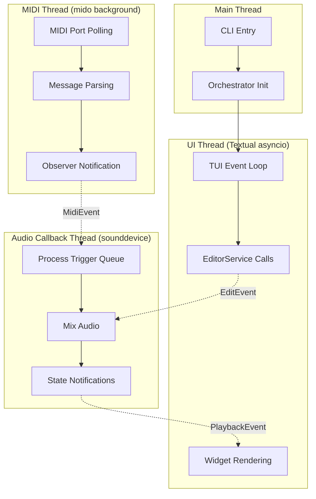
```mermaid
graph TB
    subgraph "Main Thread"
        CLI[CLI Entry]
        ORCH_INIT[Orchestrator Init]
    end

    subgraph "UI Thread (Textual asyncio)"
        TUI_LOOP[TUI Event Loop]
        EDITOR_CALL[EditorService Calls]
        TUI_RENDER[Widget Rendering]
    end

    subgraph "MIDI Thread (mido background)"
        MIDI_POLL[MIDI Port Polling]
        MSG_PARSE[Message Parsing]
        OBSERVER_NOTIFY[Observer Notification]
    end

    subgraph "Audio Callback Thread (sounddevice)"
        TRIGGER_Q[Process Trigger Queue]
        AUDIO_MIX[Mix Audio]
        STATE_NOTIFY[State Notifications]
    end

    CLI --> ORCH_INIT
    ORCH_INIT --> TUI_LOOP
    TUI_LOOP --> EDITOR_CALL
    EDITOR_CALL -.EditEvent.-> AUDIO_MIX

    MIDI_POLL --> MSG_PARSE
    MSG_PARSE --> OBSERVER_NOTIFY
    OBSERVER_NOTIFY -.MidiEvent.-> TRIGGER_Q

    TRIGGER_Q --> AUDIO_MIX
    AUDIO_MIX --> STATE_NOTIFY
    STATE_NOTIFY -.PlaybackEvent.-> TUI_RENDER
```

### 7.2 Thread Safety Mechanisms

#### Lock-Free Trigger Queue
```python
# Hot path: MIDI thread → Audio thread
# Uses Queue (thread-safe, non-blocking)
def trigger_pad(self, pad_index: int) -> None:
    self._trigger_queue.put_nowait(("trigger", pad_index))  # No lock!
```

#### Lock-Protected Sample Loading
```python
# Cold path: UI thread → Audio thread
# Uses lock (rare operation, acceptable blocking)
def load_sample(self, pad_index: int, pad: Pad) -> bool:
    # File I/O outside lock
    audio_data = self._loader.load(pad.sample.path)

    # Lock only for state mutation
    with self._lock:
        self._playback_states[pad_index] = PlaybackState(audio_data, ...)
```

#### Lock-Release-Before-Notify
```python
# State machine: Prevent deadlock
def notify_pad_playing(self, pad_index: int) -> None:
    with self._lock:
        self._playing_pads.add(pad_index)
    # Lock released - observers can query safely
    self._observers.notify('on_playback_event', PlaybackEvent.PAD_PLAYING, pad_index)
```

### 7.3 Threading Diagram

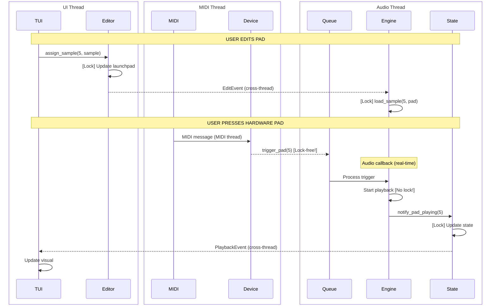
```mermaid
sequenceDiagram
    box UI Thread
        participant TUI
        participant Editor
    end

    box MIDI Thread
        participant MIDI
        participant Device
    end

    box Audio Thread
        participant Queue
        participant Engine
        participant State
    end

    Note over TUI,State: USER EDITS PAD

    TUI->>Editor: assign_sample(5, sample)
    Editor->>Editor: [Lock] Update launchpad
    Editor-->>Engine: EditEvent (cross-thread)
    Engine->>Engine: [Lock] load_sample(5, pad)

    Note over TUI,State: USER PRESSES HARDWARE PAD

    MIDI->>Device: MIDI message (MIDI thread)
    Device-->>Queue: trigger_pad(5) [Lock-free!]

    Note over Engine: Audio callback (real-time)

    Queue->>Engine: Process trigger
    Engine->>Engine: Start playback [No lock!]
    Engine->>State: notify_pad_playing(5)
    State->>State: [Lock] Update state
    State-->>TUI: PlaybackEvent (cross-thread)
    TUI->>TUI: Update visual
```

### 7.4 Thread Safety Summary

| Operation | Thread | Lock Strategy | Latency |
|-----------|--------|---------------|---------|
| Load sample | UI | Lock (cold path) | ~10-50ms (file I/O) |
| Trigger pad | MIDI | Lock-free queue | <1ms |
| Audio callback | Audio | No locks | <5ms (buffer size) |
| State notification | Audio | Lock then release | <1ms |
| Observer callbacks | Any | No locks (copy list first) | Varies |

---

## 8. PROTOCOL & OBSERVER PATTERNS

### 8.1 Protocol-First Design

Launchsampler uses **zero inheritance hierarchies**. All contracts are defined via `runtime_checkable` protocols.

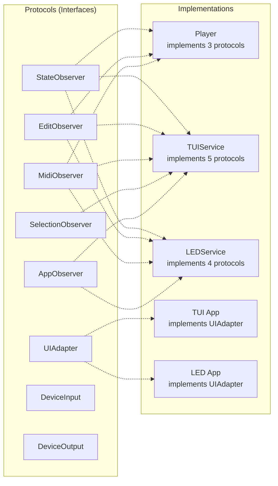
```mermaid
graph LR
    subgraph "Protocols (Interfaces)"
        SO[StateObserver]
        EO[EditObserver]
        MO[MidiObserver]
        SEO[SelectionObserver]
        AO[AppObserver]
        UI[UIAdapter]
        DI[DeviceInput]
        DO[DeviceOutput]
    end

    subgraph "Implementations"
        PLAYER[Player<br/>implements 3 protocols]
        TUI_SVC[TUIService<br/>implements 5 protocols]
        LED_SVC[LEDService<br/>implements 4 protocols]
        TUI_APP[TUI App<br/>implements UIAdapter]
        LED_APP[LED App<br/>implements UIAdapter]
    end

    SO -.-> PLAYER
    EO -.-> PLAYER
    MO -.-> PLAYER

    SO -.-> TUI_SVC
    EO -.-> TUI_SVC
    MO -.-> TUI_SVC
    SEO -.-> TUI_SVC
    AO -.-> TUI_SVC

    SO -.-> LED_SVC
    EO -.-> LED_SVC
    MO -.-> LED_SVC
    AO -.-> LED_SVC

    UI -.-> TUI_APP
    UI -.-> LED_APP
```

### 8.2 Observer Protocol Definitions

```python
# From protocols/observers.py

@runtime_checkable
class StateObserver(Protocol):
    def on_playback_event(self, event: PlaybackEvent, pad_index: int) -> None: ...

@runtime_checkable
class EditObserver(Protocol):
    def on_edit_event(self, event: EditEvent, pad_indices: list[int], pads: list[Pad]) -> None: ...

@runtime_checkable
class MidiObserver(Protocol):
    def on_midi_event(self, event: MidiEvent, pad_index: int, control: int = 0, value: int = 0) -> None: ...

@runtime_checkable
class SelectionObserver(Protocol):
    def on_selection_event(self, event: SelectionEvent, pad_index: Optional[int]) -> None: ...

@runtime_checkable
class AppObserver(Protocol):
    def on_app_event(self, event: AppEvent, **kwargs) -> None: ...
```

### 8.3 Multi-Protocol Implementation Example

```python
# Player implements 3 observer protocols
class Player(StateObserver, EditObserver, MidiObserver):

    def on_playback_event(self, event: PlaybackEvent, pad_index: int) -> None:
        # Forward to UI observers
        self._state_observers.notify('on_playback_event', event, pad_index)

    def on_edit_event(self, event: EditEvent, pad_indices: list[int], pads: list[Pad]) -> None:
        # Sync audio engine
        for pad_index, pad in zip(pad_indices, pads):
            if event == EditEvent.PAD_ASSIGNED:
                self._engine.load_sample(pad_index, pad)
            elif event == EditEvent.PAD_CLEARED:
                self._engine.unload_sample(pad_index)

    def on_midi_event(self, event: MidiEvent, pad_index: int, control: int = 0, value: int = 0) -> None:
        # Trigger audio on MIDI input
        if event == MidiEvent.NOTE_ON:
            self.trigger_pad(pad_index)
```

### 8.4 Observer Registration Pattern

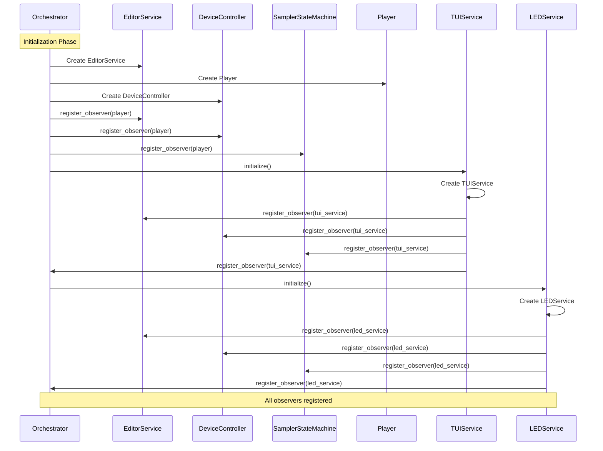
```mermaid
sequenceDiagram
    participant ORCH as Orchestrator
    participant EDITOR as EditorService
    participant DEVICE as DeviceController
    participant STATE as SamplerStateMachine
    participant PLAYER as Player
    participant TUI as TUIService
    participant LED as LEDService

    Note over ORCH: Initialization Phase

    ORCH->>EDITOR: Create EditorService
    ORCH->>PLAYER: Create Player
    ORCH->>DEVICE: Create DeviceController

    ORCH->>EDITOR: register_observer(player)
    ORCH->>DEVICE: register_observer(player)
    ORCH->>STATE: register_observer(player)

    ORCH->>TUI: initialize()
    TUI->>TUI: Create TUIService
    TUI->>EDITOR: register_observer(tui_service)
    TUI->>DEVICE: register_observer(tui_service)
    TUI->>STATE: register_observer(tui_service)
    TUI->>ORCH: register_observer(tui_service)

    ORCH->>LED: initialize()
    LED->>LED: Create LEDService
    LED->>EDITOR: register_observer(led_service)
    LED->>DEVICE: register_observer(led_service)
    LED->>STATE: register_observer(led_service)
    LED->>ORCH: register_observer(led_service)

    Note over ORCH,LED: All observers registered
```

---

## 9. DEPENDENCY GRAPH

### 9.1 Module Dependencies

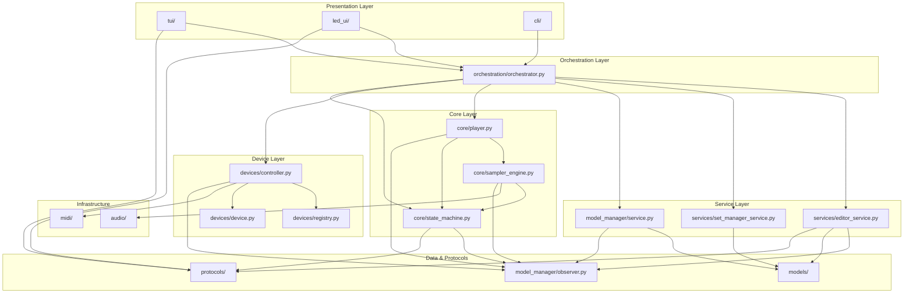
```mermaid
graph TD
    subgraph "Presentation Layer"
        TUI[tui/]
        LED[led_ui/]
        CLI[cli/]
    end

    subgraph "Orchestration Layer"
        ORCH[orchestration/orchestrator.py]
    end

    subgraph "Service Layer"
        EDITOR[services/editor_service.py]
        SETMGR[services/set_manager_service.py]
        MM[model_manager/service.py]
    end

    subgraph "Core Layer"
        PLAYER[core/player.py]
        ENGINE[core/sampler_engine.py]
        STATE[core/state_machine.py]
    end

    subgraph "Device Layer"
        DEVICE[devices/controller.py]
        REGISTRY[devices/registry.py]
        DEVGEN[devices/device.py]
    end

    subgraph "Infrastructure"
        AUDIO[audio/]
        MIDI[midi/]
    end

    subgraph "Data & Protocols"
        MODELS[models/]
        PROTO[protocols/]
        OBSERVER[model_manager/observer.py]
    end

    TUI --> ORCH
    LED --> ORCH
    CLI --> ORCH

    ORCH --> EDITOR
    ORCH --> SETMGR
    ORCH --> MM
    ORCH --> PLAYER
    ORCH --> DEVICE
    ORCH --> STATE

    EDITOR --> OBSERVER
    EDITOR --> MODELS
    EDITOR --> PROTO

    PLAYER --> ENGINE
    PLAYER --> STATE
    PLAYER --> OBSERVER

    ENGINE --> STATE
    ENGINE --> AUDIO
    ENGINE --> OBSERVER

    STATE --> OBSERVER
    STATE --> PROTO

    DEVICE --> REGISTRY
    DEVICE --> DEVGEN
    DEVICE --> MIDI
    DEVICE --> OBSERVER

    SETMGR --> MODELS
    MM --> MODELS
    MM --> OBSERVER

    TUI --> PROTO
    LED --> PROTO
```

### 9.2 Dependency Injection

```mermaid
graph LR
    ORCH[Orchestrator] -->|creates| STATE[SamplerStateMachine]
    ORCH -->|injects| PLAYER[Player]
    PLAYER -->|injects| ENGINE[SamplerEngine]

    STATE -.shared instance.-> PLAYER
    STATE -.shared instance.-> ENGINE

    style STATE fill:#ffe1e1
    style ORCH fill:#fff4e1
```

**Why Inject `SamplerStateMachine`?**
- **Single Source of Truth**: Only one instance tracks playback state
- **Consistent State**: Player and Engine see same state
- **Testability**: Can inject mock state machine
- **Event Coordination**: All events flow through same dispatcher

### 9.3 Critical Dependencies

| Component | Depends On | Why |
|-----------|-----------|-----|
| **Orchestrator** | All services | Wires application together |
| **Player** | SamplerEngine, SamplerStateMachine | Audio lifecycle |
| **SamplerEngine** | SamplerStateMachine (injected) | Playback state |
| **EditorService** | ObserverManager[EditObserver] | Event dispatch |
| **DeviceController** | DeviceRegistry, MidiManager | Hardware abstraction |
| **TUIService** | All 5 observer protocols | Multi-concern UI |
| **All Services** | Protocols, Models | Contracts |

---

## 10. DATA MODELS & STATE

### 10.1 Data Model Hierarchy

```mermaid
classDiagram
    class Set {
        +str name
        +Launchpad launchpad
        +Optional~Path~ samples_root
        +datetime created_at
        +datetime modified_at
        +create_empty() Set
    }

    class Launchpad {
        +List~Pad~ pads
        +create_empty() Launchpad
        +assigned_pads List~Pad~
        +get_pad(x: int, y: int) Pad
    }

    class Pad {
        +int x
        +int y
        +Optional~Sample~ sample
        +PlaybackMode mode
        +float volume
        +Color color
        +bool is_assigned
    }

    class Sample {
        +Path path
        +Optional~str~ name
    }

    class Color {
        +int r
        +int g
        +int b
    }

    class PlaybackMode {
        <<enumeration>>
        ONE_SHOT
        TOGGLE
        HOLD
        LOOP
        LOOP_TOGGLE
    }

    class AppConfig {
        +Path default_set_path
        +Optional~str~ audio_device_name
        +Optional~str~ midi_device_name
        +Optional~Path~ samples_root_path
        +bool auto_save
        +int default_buffer_size
        +float midi_poll_interval
    }

    Set --> Launchpad
    Launchpad --> Pad : 64 pads
    Pad --> Sample
    Pad --> Color
    Pad --> PlaybackMode

    style Set fill:#e1f5ff
    style Launchpad fill:#ffe1e1
    style Pad fill:#fff4e1
```

### 10.2 State Ownership

```mermaid
graph TB
    subgraph "Orchestrator Owns"
        STATE1[current_set: Set]
        STATE2[launchpad: Launchpad]
        STATE3[mode: str]
    end

    subgraph "Player Owns"
        STATE4[current_set: Set<br/>copy]
    end

    subgraph "EditorService Owns"
        STATE5[launchpad: Launchpad<br/>reference]
        STATE6[clipboard: Optional~Pad~]
    end

    subgraph "SamplerEngine Owns"
        STATE7[audio_cache: Dict]
        STATE8[playback_states: Dict]
    end

    subgraph "SamplerStateMachine Owns"
        STATE9[playing_pads: Set~int~]
        STATE10[triggered_pads: Set~int~]
    end

    STATE1 -.copy.-> STATE4
    STATE2 -.reference.-> STATE5
```

### 10.3 Persistence Format

#### Set JSON Format
```json
{
  "name": "My Drums",
  "samples_root": "/path/to/samples",
  "created_at": "2025-11-20T10:30:00",
  "modified_at": "2025-11-20T11:45:00",
  "launchpad": {
    "pads": [
      {
        "x": 0,
        "y": 0,
        "sample": {
          "path": "kick.wav",
          "name": "Kick"
        },
        "mode": "one_shot",
        "volume": 1.0,
        "color": {"r": 255, "g": 0, "b": 0}
      },
      // ... 63 more pads
    ]
  }
}
```

#### AppConfig JSON Format
```json
{
  "default_set_path": "~/.launchsampler/sets/default.json",
  "audio_device_name": null,
  "midi_device_name": null,
  "samples_root_path": "~/samples",
  "auto_save": true,
  "default_buffer_size": 512,
  "midi_poll_interval": 5.0,
  "panic_button_cc_control": 80,
  "panic_button_cc_value": 127
}
```

---

## 11. ENTRY POINTS & LIFECYCLE

### 11.1 Application Startup Sequence

```mermaid
sequenceDiagram
    participant User
    participant CLI
    participant ORCH as Orchestrator
    participant TUI
    participant LED
    participant PLAYER as Player
    participant DEVICE as DeviceController

    User->>CLI: launchsampler --set drums --led-ui
    CLI->>CLI: Load AppConfig
    CLI->>ORCH: Create Orchestrator(config, set_name="drums")

    CLI->>TUI: Create LaunchpadSampler (TUI app)
    CLI->>ORCH: register_ui(tui)

    CLI->>LED: Create LaunchpadLEDUI (LED app)
    CLI->>ORCH: register_ui(led)

    CLI->>ORCH: run()

    ORCH->>TUI: initialize()
    TUI->>TUI: Create TUIService, register observers

    ORCH->>LED: initialize()
    LED->>LED: Create LEDService, register observers

    ORCH->>TUI: run()
    TUI->>TUI: Start Textual event loop

    TUI->>ORCH: orchestrator.initialize() [in on_mount]

    ORCH->>ORCH: Create services
    ORCH->>DEVICE: Create DeviceController
    ORCH->>DEVICE: start()
    ORCH->>PLAYER: Create Player
    ORCH->>PLAYER: start()

    ORCH->>ORCH: Load set "drums"
    ORCH->>ORCH: mount_set(loaded_set)
    ORCH-->>TUI: AppEvent.SET_MOUNTED
    ORCH-->>LED: AppEvent.SET_MOUNTED

    ORCH->>ORCH: set_mode("edit")
    ORCH-->>TUI: AppEvent.MODE_CHANGED
    ORCH-->>LED: AppEvent.MODE_CHANGED

    Note over TUI,LED: Application running

    TUI->>TUI: User quits (Ctrl+C)
    TUI->>ORCH: shutdown()
    ORCH->>PLAYER: stop()
    ORCH->>DEVICE: stop()
```

### 11.2 Initialization Phases

```mermaid
stateDiagram-v2
    [*] --> Construction
    Construction --> UIRegistration : register_ui()
    UIRegistration --> UIInitialization : orch.run() → ui.initialize()
    UIInitialization --> ServiceCreation : orch.initialize()
    ServiceCreation --> SetLoading : mount_set()
    SetLoading --> ModeSet : set_mode()
    ModeSet --> Running
    Running --> Shutdown : user quits
    Shutdown --> [*]

    note right of Construction
        Create Orchestrator
        Shared SamplerStateMachine
    end note

    note right of UIRegistration
        Register TUI + LED
        UIs observe AppEvents
    end note

    note right of ServiceCreation
        Create Player, Editor,
        DeviceController, etc.
        Wire observers
    end note

    note right of SetLoading
        Load/create initial set
        Fire SET_MOUNTED event
    end note
```

### 11.3 Shutdown Sequence

```mermaid
sequenceDiagram
    participant User
    participant TUI
    participant ORCH as Orchestrator
    participant PLAYER as Player
    participant ENGINE as SamplerEngine
    participant DEVICE as DeviceController
    participant LED

    User->>TUI: Press Ctrl+C
    TUI->>TUI: Exit event loop
    TUI->>ORCH: shutdown()

    ORCH->>TUI: ui.shutdown()
    TUI->>TUI: Cleanup widgets

    ORCH->>LED: ui.shutdown()
    LED->>LED: Cleanup observers

    ORCH->>PLAYER: stop()
    PLAYER->>ENGINE: stop()
    ENGINE->>ENGINE: stop_all()
    ENGINE->>ENGINE: Close audio device

    ORCH->>DEVICE: stop()
    DEVICE->>DEVICE: Shutdown device output
    DEVICE->>DEVICE: Close MIDI ports

    ORCH->>ORCH: Clear observers
```

---

## 12. KEY DESIGN PATTERNS

### 12.1 Observer Pattern (Pervasive)

**Usage:** Event-driven communication across all layers

```python
# Generic implementation
class ObserverManager[T]:
    def notify(self, callback_name: str, *args, **kwargs) -> None:
        with self._lock:
            observers = list(self._observers)  # Copy
        # Lock released - prevent deadlock
        for observer in observers:
            callback = getattr(observer, callback_name)
            callback(*args, **kwargs)
```

**Benefits:**
- Decoupling (services don't know about UIs)
- Extensibility (add new UIs without changing core)
- Multi-UI support (TUI + LED simultaneously)

---

### 12.2 Dependency Injection

**Usage:** Shared `SamplerStateMachine` injection

```python
# Orchestrator creates and injects
self.state_machine = SamplerStateMachine()
self.player = Player(config, state_machine=self.state_machine)

# Player injects into Engine
self._engine = SamplerEngine(audio_device, state_machine=self._state_machine)
```

**Benefits:**
- Single source of truth
- Testability (inject mocks)
- Lifecycle control

---

### 12.3 Registry Pattern

**Usage:** Device detection and creation

```python
class DeviceRegistry:
    def detect_device(self, port_name: str) -> Optional[DeviceConfig]:
        # Load configs from JSON
        # Match port name against patterns
        # Return config if found

    def create_device(self, config: DeviceConfig, midi: MidiManager) -> GenericDevice:
        # Instantiate input/output handlers
        # Assemble GenericDevice
```

**Benefits:**
- Extensibility (add new devices via JSON)
- Separation of concerns (detection vs creation)
- Factory pattern

---

### 12.4 Protocol-First Design

**Usage:** All interfaces defined as protocols, zero inheritance

```python
@runtime_checkable
class StateObserver(Protocol):
    def on_playback_event(self, event: PlaybackEvent, pad_index: int) -> None: ...

# Multiple implementations
class Player(StateObserver, EditObserver, MidiObserver):
    # Implements 3 protocols

class TUIService(StateObserver, EditObserver, MidiObserver, SelectionObserver, AppObserver):
    # Implements 5 protocols
```

**Benefits:**
- Composition over inheritance
- Duck typing
- Multiple "inheritance" without diamond problem

---

### 12.5 Lock-Free Queue Pattern

**Usage:** MIDI → Audio thread communication

```python
# Hot path: zero blocking
def trigger_pad(self, pad_index: int) -> None:
    self._trigger_queue.put_nowait(("trigger", pad_index))

# Audio callback processes queue
while not self._trigger_queue.empty():
    action, pad_index = self._trigger_queue.get_nowait()
    # Process trigger
```

**Benefits:**
- Minimal latency (<1ms)
- No audio glitches from lock contention
- Real-time safe

---

### 12.6 Lock-Release-Before-Notify

**Usage:** Prevent deadlock in observer notifications

```python
def notify_pad_playing(self, pad_index: int) -> None:
    with self._lock:
        self._playing_pads.add(pad_index)
    # Lock released HERE
    self._observers.notify('on_playback_event', PlaybackEvent.PAD_PLAYING, pad_index)
    # Observers can safely call is_pad_playing() without deadlock
```

**Benefits:**
- Thread safety
- Deadlock prevention
- Observers can query state during callbacks

---

### 12.7 Adapter Pattern

**Usage:** UI abstraction

```python
class UIAdapter(Protocol):
    def initialize(self) -> None: ...
    def run(self) -> None: ...
    def shutdown(self) -> None: ...

# TUI implementation
class LaunchpadSampler(UIAdapter):
    # Textual-specific implementation

# LED implementation
class LaunchpadLEDUI(UIAdapter):
    # Hardware LED-specific implementation
```

**Benefits:**
- Multiple UI implementations
- Orchestrator doesn't know about UI details
- Easy to add web UI, native GUI, etc.

---

## 13. CRITICAL ARCHITECTURAL DECISIONS

### 13.1 Why Protocol-First Instead of Inheritance?

**Decision:** Use runtime-checkable protocols for all interfaces

**Rationale:**
- **Multiple "inheritance"**: Classes can implement 3-5 protocols without diamond problem
- **Duck typing**: Python-native approach
- **Loose coupling**: No shared base class dependencies
- **Testability**: Easy to create mocks

**Example:**
```python
# Player implements 3 protocols naturally
class Player(StateObserver, EditObserver, MidiObserver):
    pass
```

---

### 13.2 Why Inject SamplerStateMachine?

**Decision:** Create single instance in Orchestrator, inject into Player → Engine

**Rationale:**
- **Single source of truth**: Only one instance tracks playback state
- **Consistent events**: All observers get events from same dispatcher
- **Testability**: Can inject mock state machine
- **Prevents bugs**: Eliminates possibility of state drift

**Alternative Rejected:** Each component creates own state machine
**Problem:** State inconsistencies, duplicate events

---

### 13.3 Why Generic ObserverManager[T]?

**Decision:** Create reusable generic observer manager

**Rationale:**
- **DRY**: Eliminates ~150 lines of duplicate code across 5+ classes
- **Consistency**: Same behavior everywhere
- **Thread safety**: Lock-release-before-notify pattern baked in
- **Type safety**: Generic TypeVar provides type checking

**Alternative Rejected:** Copy-paste observer code in each service
**Problem:** Maintenance burden, inconsistent behavior, bugs

---

### 13.4 Why Lock-Free Trigger Queue?

**Decision:** Use `Queue.put_nowait()` for MIDI → Audio communication

**Rationale:**
- **Minimal latency**: <1ms trigger-to-sound
- **Real-time safe**: Audio callback never blocks
- **Prevents glitches**: No lock contention in audio thread
- **Thread-safe**: Queue is inherently thread-safe

**Alternative Rejected:** Lock-protected direct state modification
**Problem:** Audio glitches from lock contention, unacceptable latency

---

### 13.5 Why Multi-UI Architecture?

**Decision:** Support multiple UIs running simultaneously (TUI + LED)

**Rationale:**
- **Better UX**: Visual TUI + hardware LED feedback
- **Extensibility**: Easy to add web UI, native GUI
- **Separation of concerns**: UIs observe events, don't own state
- **Testability**: Can run headless (LED only)

**Implementation:** UIAdapter protocol + observer pattern

---

### 13.6 Why Event-Driven Instead of Direct Calls?

**Decision:** Use observer pattern for cross-component communication

**Rationale:**
- **Decoupling**: Services don't know about UIs
- **Multi-UI support**: One event → N observers
- **Testability**: Easy to spy on events
- **Undo/Redo ready**: Events are discrete, replayable

**Alternative Rejected:** Direct method calls (service → UI)
**Problem:** Tight coupling, can't support multiple UIs

---

### 13.7 Why Pydantic for Data Models?

**Decision:** Use Pydantic BaseModel for all data structures

**Rationale:**
- **Validation**: Automatic type checking, constraints
- **JSON serialization**: Built-in to/from JSON
- **Immutability**: Can enable frozen models
- **IDE support**: Type hints for autocomplete

**Alternative Rejected:** Plain dataclasses
**Problem:** Manual validation, no JSON support

---

### 13.8 Why Device Registry Pattern?

**Decision:** JSON-based device detection and factory

**Rationale:**
- **Extensibility**: Add new devices without code changes
- **Configuration**: Port selection logic externalized
- **Maintainability**: Device configs in one place
- **Testing**: Can inject test devices

**Alternative Rejected:** Hardcoded device detection
**Problem:** Not extensible, scattered logic

---

## CONCLUSION

Launchsampler demonstrates a mature, well-architected Python application with:

1. **Clean Separation of Concerns**: Layers, services, protocols
2. **Thread Safety**: Lock-free hot paths, lock-release-before-notify
3. **Extensibility**: Protocol-first, observer pattern, registry pattern
4. **Reusability**: Generic components (ObserverManager[T])
5. **Testability**: Dependency injection, protocols
6. **Multi-UI Support**: Adapter pattern, observer pattern
7. **Real-Time Performance**: Lock-free queues, efficient audio mixing

The architecture prioritizes:
- **Correctness** (thread safety, single source of truth)
- **Performance** (lock-free hot paths, caching)
- **Maintainability** (DRY, SOLID, clear responsibilities)
- **Extensibility** (protocols, registries, observers)

This makes it an excellent example of Python application architecture following best practices from both the Python ecosystem (Zen of Python, PEP8) and software engineering principles (SOLID, design patterns).

---

**Document Version:** 1.0
**Last Updated:** 2025-11-20
**Author:** Claude (Architecture Analysis Agent)
