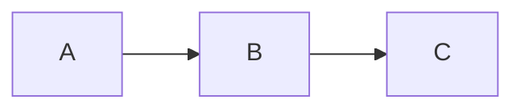

# LaunchSampler Documentation

This directory contains the source for LaunchSampler's documentation, built with [Material for MkDocs](https://squidfunk.github.io/mkdocs-material/).

## Building the Documentation

### Install Dependencies

```bash
# Install with uv (recommended)
uv sync

# Or with pip
pip install mkdocs-material
```

### Preview Locally

```bash
# Serve with live reload (default: http://127.0.0.1:8000)
uv run mkdocs serve

# Or specify a different port
uv run mkdocs serve --dev-addr localhost:8001
```

### Build Static Site

```bash
# Build to site/ directory
uv run mkdocs build

# Build with strict mode (fail on warnings)
uv run mkdocs build --strict
```

## Documentation Structure

```
docs/
├── index.md                    # Home page
├── getting-started/            # Installation, quick start, config
│   ├── installation.md
│   ├── quick-start.md
│   └── configuration.md
├── user-guide/                 # User documentation
│   ├── overview.md
│   ├── edit-mode.md
│   ├── play-mode.md
│   ├── keyboard-shortcuts.md
│   ├── midi-integration.md
│   └── sample-management.md
├── architecture/               # Architecture docs
│   ├── overview.md
│   ├── design-principles.md
│   ├── components.md
│   ├── event-system.md
│   └── threading-model.md
├── api/                        # API reference
│   ├── core/
│   ├── services/
│   ├── models/
│   └── devices/
├── contributing/               # Contributing guides
│   ├── development-setup.md
│   ├── code-style.md
│   ├── testing.md
│   └── pull-requests.md
├── changelog.md                # Version history
├── license.md                  # License info
└── stylesheets/
    └── extra.css               # Custom CSS
```

## Writing Documentation

### Markdown Extensions

Material for MkDocs supports many extensions:

#### Admonitions

```markdown
!!! note "Optional Title"
    This is a note admonition

!!! tip
    This is a tip

!!! warning
    This is a warning
```

#### Code Blocks with Syntax Highlighting

````markdown
```python
def hello():
    print("Hello, World!")
```
````

#### Tabs

```markdown
=== "Python"
    ```python
    print("Hello")
    ```

=== "JavaScript"
    ```javascript
    console.log("Hello")
    ```
```

#### Keyboard Shortcuts

```markdown
Press ++ctrl+c++ to copy
```

#### Mermaid Diagrams

````markdown

````

### Links

- **Internal pages:** `[Link text](page.md)`
- **Sections:** `[Link text](page.md#section)`
- **External:** `[Link text](https://example.com)`

## Style Guide

### General Guidelines

- Use **active voice**
- Be **concise** - respect the reader's time
- Use **code examples** liberally
- Include **diagrams** for complex concepts

### Code Examples

- Provide **complete, runnable** examples
- Include **comments** for clarity
- Show **expected output** when relevant

### File Names

- Use **lowercase**
- Use **hyphens** for spaces (e.g., `getting-started.md`)
- Be **descriptive** (e.g., `keyboard-shortcuts.md` not `shortcuts.md`)

## Contributing

See [Contributing Guide](contributing/development-setup.md) for details on contributing to the documentation.

### Common Tasks

#### Add a New Page

1. Create the markdown file in the appropriate directory
2. Add it to the `nav` section in `mkdocs.yml`
3. Link to it from related pages

#### Add Images

1. Place images in `docs/assets/images/`
2. Reference with: ``

#### Update Navigation

Edit the `nav` section in `mkdocs.yml`:

```yaml
nav:
  - Home: index.md
  - Section Name:
      - Page: section/page.md
```

## Deployment

The documentation can be deployed to GitHub Pages, Netlify, or any static hosting service.

### GitHub Pages with GitHub Actions

Create `.github/workflows/docs.yml`:

```yaml
name: Deploy Docs
on:
  push:
    branches: [main]

jobs:
  deploy:
    runs-on: ubuntu-latest
    steps:
      - uses: actions/checkout@v4
      - uses: actions/setup-python@v5
        with:
          python-version: 3.x
      - run: pip install mkdocs-material
      - run: mkdocs gh-deploy --force
```

## Resources

- [Material for MkDocs Documentation](https://squidfunk.github.io/mkdocs-material/)
- [MkDocs User Guide](https://www.mkdocs.org/user-guide/)
- [Markdown Guide](https://www.markdownguide.org/)
