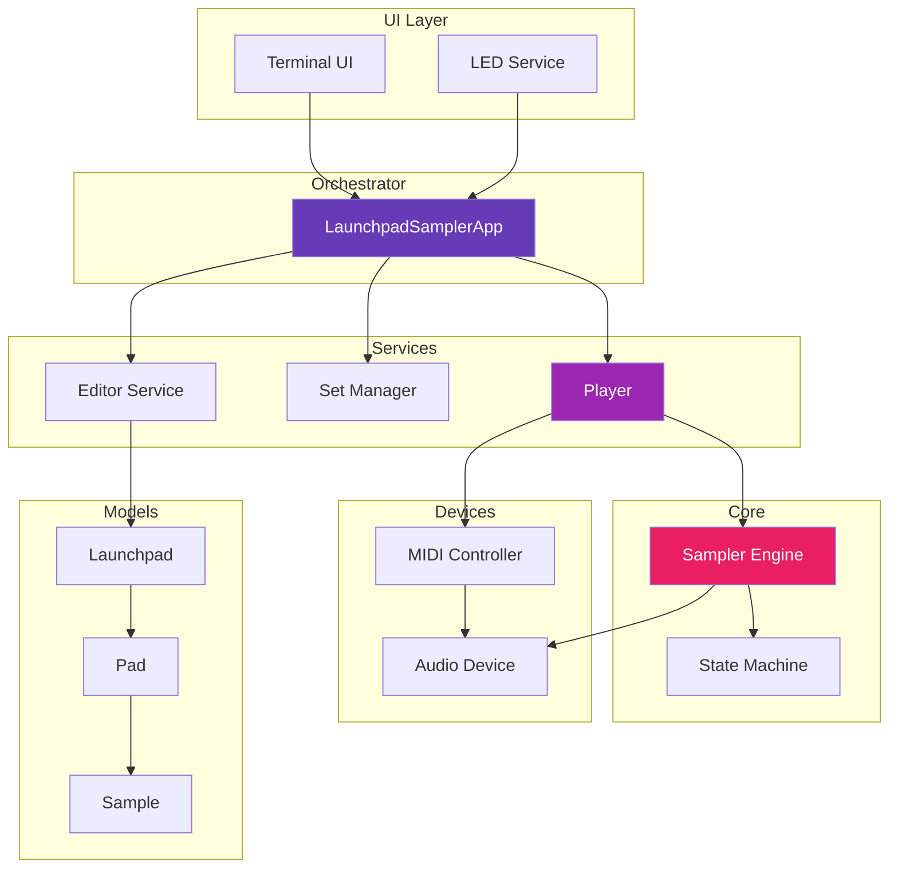
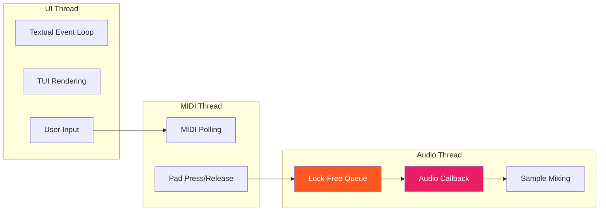
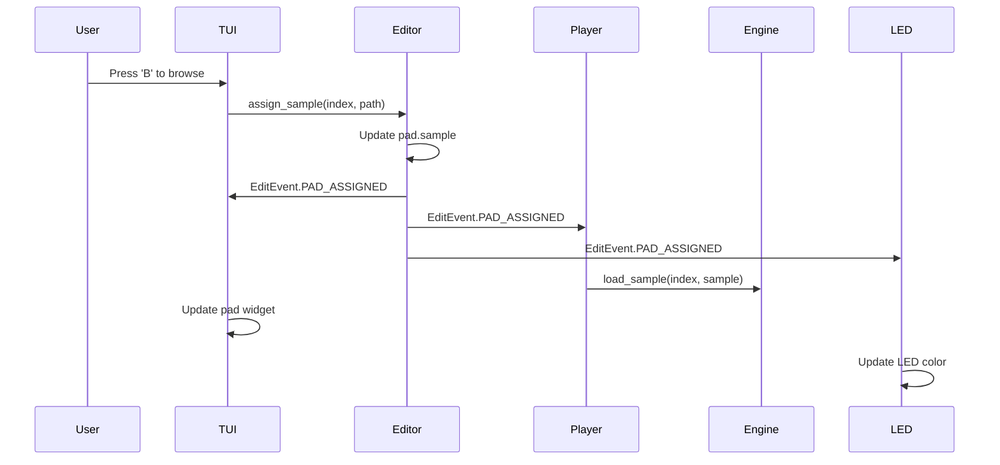

# Architecture Overview

LaunchSampler follows a **clean architecture** with clear separation of concerns, event-driven synchronization, and SOLID design principles.

## High-Level Architecture



## Design Principles

LaunchSampler is built on **SOLID principles**:

### Single Responsibility Principle
Each component has one well-defined purpose:

- **EditorService**: Pad editing operations only
- **Player**: Audio/MIDI coordination only
- **SamplerEngine**: Low-level audio rendering only
- **TUIService**: UI rendering and updates only

### Open/Closed Principle
Extension without modification through protocols:

```python
@runtime_checkable
class StateObserver(Protocol):
    """Any object can observe playback events."""
    def on_playback_event(self, event: PlaybackEvent, pad_index: int) -> None:
        ...
```

### Liskov Substitution Principle
All implementations are interchangeable:

- Any `DeviceInput` works for MIDI
- Any `DeviceOutput` works for audio
- Any `StateObserver` can receive events

### Interface Segregation Principle
Focused, granular protocols:

- `EditObserver` - Editing events only
- `StateObserver` - Playback events only
- `MidiObserver` - MIDI events only
- `AppObserver` - App lifecycle events only

### Dependency Inversion Principle
High-level modules depend on abstractions:

```python
class Player:
    def __init__(
        self,
        config: AppConfig,
        state_machine: Optional[SamplerStateMachine] = None
    ):
        # Dependency injection, not hard-coded creation
        self._state_machine = state_machine or SamplerStateMachine()
```

## Key Patterns

### Observer Pattern

Event-driven synchronization keeps all components in sync:

```python
# Editor fires events when pads change
editor.assign_sample(pad_index, sample_path)
  → EditEvent.PAD_ASSIGNED
    → TUIService updates UI
    → Player loads sample into engine
    → LEDService updates LED color
```

**Benefits:**
- ✅ Loose coupling - components don't know about each other
- ✅ Automatic synchronization - no manual update calls
- ✅ Extensible - add new observers without changing existing code

### Service Layer Pattern

Services encapsulate business logic:

```python
# EditorService - Manages pad edits
editor.assign_sample(index, path)
editor.set_pad_mode(index, mode)
editor.move_pad(source, target)

# SetManagerService - Manages sample sets
set_manager.open_set(path)
set_manager.save_set(set_obj, path)
set_manager.create_from_directory(path)

# Player - Manages playback
player.trigger_pad(index)
player.stop_pad(index)
player.set_master_volume(volume)
```

**Benefits:**
- ✅ Testable - Services have clear inputs/outputs
- ✅ Reusable - Same services for TUI and LED UI
- ✅ Maintainable - Business logic in one place

### Device Abstraction

Hardware is abstracted behind protocols:

```python
class DeviceInput(Protocol):
    """Generic MIDI input device."""
    def parse_input(msg: mido.Message) -> Optional[tuple[str, int]]:
        ...

class LaunchpadInput(DeviceInput):
    """Launchpad-specific implementation."""
    # Handles Launchpad MIDI quirks
```

**Benefits:**
- ✅ Hardware-agnostic - Easy to support new devices
- ✅ Testable - Mock devices for testing
- ✅ Flexible - Switch devices at runtime

## Threading Model

LaunchSampler uses **three threads** for real-time performance:



### Thread Details

| Thread | Purpose | Locks | Priority |
|--------|---------|-------|----------|
| **UI Thread** | User interface, editing | Standard locks | Normal |
| **MIDI Thread** | Hardware input polling | Lock-free queue | High |
| **Audio Thread** | Real-time audio rendering | **No locks!** | Real-time |

### Lock-Free Audio Path

The audio callback is **completely lock-free** for minimal latency:

```python
# Audio callback (real-time thread)
def _audio_callback(self, outdata, frames, time, status):
    # NO LOCKS - just pop from lock-free queue
    while not self._trigger_queue.empty():
        action, pad_index = self._trigger_queue.get()
        self._process_action(action, pad_index)

    # Mix audio from active pads
    self._render_audio(outdata, frames)
```

**Key Insight:** Triggers go through a lock-free queue, so the audio thread never blocks.

## State Management

### Single Source of Truth

Each piece of state has **one authoritative source**:

| State | Source | Observers |
|-------|--------|-----------|
| Pad data | `Launchpad.pads` | TUI, LED, Player |
| Playing pads | `SamplerStateMachine` | TUI, LED, Editor |
| Current set | `Orchestrator.current_set` | TUI, SetManager |
| Audio state | `SamplerEngine` | Player, State Machine |

### No State Duplication

Components **query** canonical sources instead of caching:

```python
# ❌ BAD: Duplicate state cache
class LEDService:
    def __init__(self):
        self._playing_pads = set()  # Duplicate!

# ✅ GOOD: Query canonical source
class LEDService:
    def _is_pad_playing(self, pad_index: int) -> bool:
        return self.state_machine.is_pad_playing(pad_index)
```

## Event Flow Example

Here's how an edit operation flows through the system:



## Next Steps

- [Design Principles](design-principles.md) - Deep dive into SOLID
- [Components](components.md) - Detailed component documentation
- [Event System](event-system.md) - Event types and observers
- [Threading Model](threading-model.md) - Thread safety details
