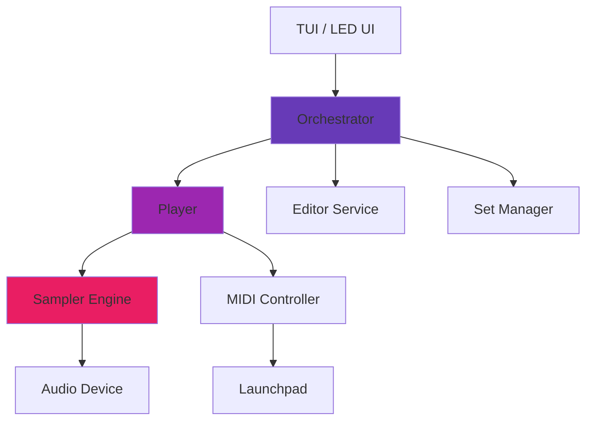

# LaunchSampler

Welcome to **LaunchSampler** - a powerful, Python-based sampler that transforms your Novation Launchpad into a professional sample playback instrument.

<div class="grid cards" markdown>

-   :material-download:{ .lg .middle } __Installation__

    ---

    Get started quickly with pip or uv

    [:octicons-arrow-right-24: Install now](getting-started/installation.md)

-   :material-lightning-bolt:{ .lg .middle } __Quick Start__

    ---

    Learn the basics in 5 minutes

    [:octicons-arrow-right-24: Quick start guide](getting-started/quick-start.md)

-   :material-keyboard:{ .lg .middle } __User Guide__

    ---

    Master edit mode, play mode, and shortcuts

    [:octicons-arrow-right-24: Read the guide](user-guide/overview.md)

-   :material-wrench:{ .lg .middle } __Troubleshooting__

    ---

    Solve common audio, MIDI, and configuration issues

    [:octicons-arrow-right-24: Get help](troubleshooting.md)

-   :material-file-code:{ .lg .middle } __API Reference__

    ---

    Detailed API documentation for developers

    [:octicons-arrow-right-24: API docs](api/core/player.md)

</div>

## Features

### :material-music: **Professional Sampler**
- **64 pads** - Full 8x8 grid support for all Launchpad models
- **Multiple playback modes** - One-shot, Loop, Hold, and Loop Toggle
- **Real-time control** - Low-latency audio playback and MIDI triggering
- **Sample management** - Organize samples in sets, load from directories

### :material-lightbulb: **Dual UI**
- **Terminal UI (TUI)** - Powerful Textual-based interface for editing and playback
- **LED Feedback** - Hardware LED synchronization for visual feedback
- **Edit Mode** - Build and configure your sample sets
- **Play Mode** - Live performance with full MIDI integration

### :material-code-braces: **Developer-Friendly**
- **Clean architecture** - SOLID principles, observer patterns, event-driven
- **Type-safe** - Full type hints with Pydantic models
- **Well-tested** - Comprehensive test suite with 377+ tests
- **Extensible** - Protocol-based design for easy customization

### :material-speedometer: **High Performance**
- **Lock-free audio** - Sub-millisecond trigger latency
- **Thread-safe** - Robust multi-threaded architecture
- **Optimized mixing** - Efficient audio rendering for multiple voices

## Project Status

!!! info "Version 0.1.0"
    LaunchSampler is in active development. The core features are stable, but the API may change before 1.0.

- ✅ Core audio engine with lock-free triggering
- ✅ TUI with edit and play modes
- ✅ MIDI integration for all Launchpad models
- ✅ Sample set management (load, save, organize)
- ✅ Comprehensive test coverage (377 tests)
- 🚧 LED hardware synchronization (in progress)
- 🚧 Advanced features (effects, automation)

## Quick Example

```python
from launchsampler.app import LaunchpadSamplerApp
from launchsampler.models import AppConfig

# Create and run the app
config = AppConfig.load_or_default()
app = LaunchpadSamplerApp(config)
app.run()
```

## Architecture Highlights

LaunchSampler follows **SOLID principles** and uses an **event-driven architecture**:



- **Observer Pattern** - Event-driven synchronization between UI, audio, and MIDI
- **Service Layer** - Clear separation of concerns (Editor, Player, SetManager)
- **Device Abstraction** - Protocol-based design for audio and MIDI devices
- **Thread Safety** - Careful lock management for real-time performance

## Get Involved

LaunchSampler is open source! We welcome contributions:

- :fontawesome-brands-github: [GitHub Repository](https://github.com/yourusername/launchsampler)
- :material-bug: [Report Issues](https://github.com/yourusername/launchsampler/issues)
- :material-comment-multiple: [Discussions](https://github.com/yourusername/launchsampler/discussions)
- :material-file-document: [Contributing Guide](contributing/development-setup.md)

## License

LaunchSampler is licensed under the MIT License. See [License](license.md) for details.
